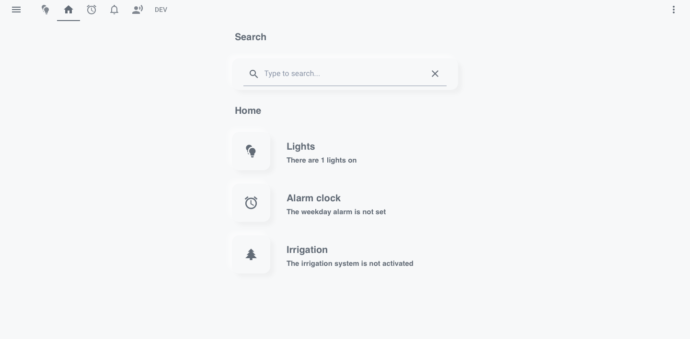

# Lovelace Soft UI 

[](https://github.com/N-l1/lovelace-soft-ui/blob/master/LICENSE) 
[](#) 
[](https://github.com/N-l1)

**Hey there!** First and foremost, thank you for finding your way to my Home Assistant repo. Here you will find my custom Neumorphic/Soft UI styled Lovelace (UI of Home Assistant). I hope you like it!

**Click** [**here**](docs/inspiration.md) **for some examples and inspiration** 

**Don't hesitate to ask for help [**here**](https://community.home-assistant.io/t/lovelace-soft-ui-simple-and-clean-lovelace-configuration) on the Home Assistant forum** 


# Let's do it!

### Alternatives
**[@Savjee](https://github.com/Savjee)'s [Button Text Card](https://github.com/Savjee/button-text-card).** If you are only looking to implement this style on a button, this is the way. It is very easy to install and set up. The downside, however, is that you will not be able to implement this style on any other card.

**[@KTibow](https://github.com/KTibow)'s [dark](https://github.com/KTibow/lovelace-dark-soft-ui-theme/) and [light](https://github.com/KTibow/lovelace-light-soft-ui-theme/) Soft UI themes.** If you are looking for a quick and simple way to implement this style universally to all your cards, this is the way. KTibow's themes are easier to implement, faster to set up, and will still work with any of the custom cards inside this repo. However, using the way described in this repo provides more flexibility and customizability. 

## 1. Install card-mod
OK so you've decided to redo your UI, don't worry, your UI will look as great as the screenshots following these 3 simple steps! First of all, you will need to install [**card-mod**](https://github.com/thomasloven/lovelace-card-mod). It is a custom card available on [HACS](https://hacs.xyz) (the Home Assistant Community Store). Please read HACS [documentation](https://hacs.xyz) and install it.

## 2. Custom Light and Dark Themes
The cards and styling in this repo are coded to be used with a light theme when the sun is up and a dark theme when the sun is down. Although Home Assistant, by default, provides a light and dark theme, this style works best with custom themes.

You might of already installed [HACS](https://hacs.xyz) from the previous step, and conveniently, besides custom-cards, there are also tons of customs themes available on HACS. Pick out both a light and dark theme you like,  but **please note that themes with pure white/black backgrounds will not work.** Light themes with a milky white background work well, and dark themes with a dark gray background work well. 

The themes used in the screenshots of this repo are the [Clear](https://github.com/naofireblade/clear-theme) and [Slate](https://github.com/seangreen2/slate_theme) theme by [**@naofireblade**](https://github.com/naofireblade) and [**@seangreen2**](https://github.com/seangreen2) (they are both available on HACS). If you decide to use the Clear theme, please make sure to remove the `lovelace-background` line from the theme's source code (located at `config/themes/clear/clear.yaml`).

Now that you have picked out your light and dark themes, we have to tell Home Assistant to switch to them at sunset and sunrise. To do this, first, make sure that your device and browser support dark mode detection, and you are on Home Assistant 0.114 or above. If not, see the **Alternative setup** section below. 

If your device does match the requirements, you will now need to make a service call in Home Assistant. In the sidebar select Developer Tools and then navigate to the services tab and select `frontend.set_theme` from the service dropdown. In the Service Data field enter the following and modify as required. You will have to call the service twice, once for your light theme and once for your dark theme.

```yaml
name: name of your theme
mode: light # or dark
```

### Alternative setup

Alternatively, after you've picked out custom light and dark themes, you can just add the following into your `automations.yaml`.

<details><summary><b>Show code</b></summary>

```yaml
# Example automations.yaml entry
- id: set_theme
  alias: Set Theme
  trigger:
  - platform: homeassistant
    event: start
  - platform: state
    entity_id: sun.sun
  action:
  - choose:
    - conditions:
      - condition: state
        entity_id: sun.sun
        state: "above_horizon"
      sequence:
      - service: frontend.set_theme
        data:
# Change this to the name of your light theme
          name: Name of your light theme
    - conditions:
      - condition: state
        entity_id: sun.sun
        state: "below_horizon"
      sequence:
      - service: frontend.set_theme
        data:
# Change this to the name of your dark theme
          name: Name of your dark theme
```
</details>

## 3. Done!
We are done! Add this code to any card config to style it with Soft UI. 

```yaml
# Example entry
style: |
  ha-card {
      background-color: var(--primary-background-color);
      border-radius: 15px;
      margin: 10px;
      box-shadow:
        
          -4px -4px 8px rgba(255,255,255,.5),5px 5px 8px rgba(0,0,0,.03);
        
          -5px -5px 8px rgba(50, 50, 50,.2),5px 5px 8px rgba(0,0,0,.08);
        
   }
```

<details><summary>Alternative code for button cards</summary>

```yaml
triggers_update:
  - sun.sun
styles:
  card:
    - box-shadow: |
        [[[ return states['sun.sun'].state == 'below_horizon'
          ? '-4px -4px 8px rgba(255,255,255,.5),5px 5px 8px rgba(0,0,0,.03)'
          : '-5px -5px 8px rgba(50, 50, 50,.2),5px 5px 8px rgba(0,0,0,.08)';
        ]]]
```

</details>

# Advanced Usage
Here are some cards I created using this style. All cards are added using the UI. Click on the three dots on the top right, go to `Configure UI`, then click on the `+` on the bottom right, and select `Manual`. Paste in the appropriate code for each card.

## Compact Header
<p align="left">
  
  
  <br/>
 The <b>default</b> header VS the <b>compact</b> header.
</p>

This makes the original Home Assistant header "compact" while also matching it with the background color. To add this card, click on the three dots on the top right, then go to `Configure UI` then `Raw config editor` and add the following to the top:

**Required Custom Cards:**

* [**Custom Header**](https://maykar.github.io/custom-header), by [**@maykar**](https://github.com/maykar)


<details><summary><b>Show code</b></summary>

```yaml
# Example entry
custom_header:
  # Makes header compact
  compact_mode: true
  # Makes background transparent
  background: transparent
  # Hide help entry
  hide_help: true
  # Makes tabs the same color as the text color
  elements_color: var(--primary-text-color)
  # Makes line under selected tab color same as sidebar selected panel color
  tab_indicator_color: var(--sidebar-selected-icon-color)
  # Makes selected tab color same as sidebar selected panel color
  active_tab_color: var(--sidebar-selected-icon-color)
  # Make mobile view notification dot color same as selected panel color
  notification_dot_color: var(--sidebar-selected-icon-color)
```
</details>

## Text Cards
**All text cards below require:**
* [**Card Mod**](https://github.com/thomasloven/lovelace-card-mod), by [**@thomasloven**](https://github.com/thomasloven)

### Heading
<p align="left">
  
  
  <br/>
</p>

This card displays texts with transparent background.

<details><summary><b>Show code</b></summary>

```yaml
# Example entry
content: |
  # Enter what you want to display here
style:
  .: |
    ha-card {
      --ha-card-background: none !important;
      box-shadow: none !important;
    }
  ha-markdown:
    $: |
      h1 {
        font-size: 20px;
        font-weight: bold;
        font-family: Helvetica;
        letter-spacing: '-0.01em';
      }
type: markdown
```
</details>

### Heading and Subheading

<p align="left">
  
  
  <br/>
</p>

This card displays texts with smaller texts underneath with transparent background.

<details><summary><b>Show code</b></summary>

```yaml
# Example entry
cards:
  - content: |
      # Enter what you want to display here
    style:
      .: |
        ha-card {
          --ha-card-background: none !important;
          box-shadow: none !important;
          height: 20px;
        }
      ha-markdown:
        $: |
          h1 {
            font-size: 20px;
            font-weight: bold;
            font-family: Helvetica;
            letter-spacing: '-0.01em';
          }
    type: markdown
  - content: |
      # Enter what you want to display in the small text
    style:
      .: |
        ha-card {
          --ha-card-background: none !important;
          box-shadow: none !important;
          height: 50px;
        }
      ha-markdown:
        $: |
          h1 {
            font-size: 15px;
            font-weight: thin;
            font-family: Helvetica;
            letter-spacing: '-0.01em';
          }
    type: markdown
type: vertical-stack
```
</details>

## Button Cards
Below you will find different button variations using the Soft UI style. All the buttons can be placed in a ```horizontal-stack``` or ```vertical-stack``` card to form a row or column of buttons (as seen in some of the screenshots). The button cards with borders are inspired by [**@hawk**](https://community.home-assistant.io/u/hawk/summary)'s beautiful [dashboard](https://community.home-assistant.io/t/lovelace-soft-ui-simple-and-clean-lovelace-configuration/159357/203).

**All button cards below require:**

* [**Button Card**](https://github.com/custom-cards/button-card), by [**@RomRider**](https://github.com/RomRider)
* [**Card Mod**](https://github.com/thomasloven/lovelace-card-mod), by [**@thomasloven**](https://github.com/thomasloven)

### Button, No Text, No Border
<p align="left">
  
  
  <br/>
</p>

This card is a simple button with an icon. When the state of the entity is `on`, the button will be pressed in (picture on the right). When the entity is `off` the button will be released (picture on the left). 

<details><summary><b>Show code</b></summary>

```yaml
# Example entry
# Change this to the entity you want to control
entity: light.example
# Change this to the icon you want to display
icon: 'mdi:lamp'
show_icon: true
show_name: false
style: |
  * {
    --soft-ui-pressed: 
           inset -3px -3px 5px rgba(255,255,255,.65), inset 3px 3px 5px rgba(0,0,0,.035);
         
           inset -3px -3px 5px rgba(50, 50, 50,.5), inset 3px 3px 5px rgba(0,0,0,.3);
         
    --soft-ui-shadow: 
          -4px -4px 8px rgba(255,255,255,.5),5px 5px 8px rgba(0,0,0,.03);
        
          -5px -5px 8px rgba(50, 50, 50,.2),5px 5px 8px rgba(0,0,0,.08);
        
  }
styles:
  card:
    - width: 60px
    - height: 60px
    - margin: 10px
    - border-radius: 15px
    - box-shadow: var(--soft-ui-shadow)
    - background-color: var(--primary-background-color)
  icon:
    - color: var(--primary-text-color)
state:
  - value: 'on'
    styles:
      card:
        - box-shadow: var(--soft-ui-pressed)
      icon:
        - color: var(--paper-item-icon-active-color)
tap_action:
  action: toggle
  haptic: light
hold_action:
  action: more-info
  haptic: medium
type: 'custom:button-card'
```
</details>

### Button, No Text, With Border
<p align="left">
  
  
  <br/>
</p>

This card is almost identical to the one above. The only difference between the two is when this button is pressed there is a border surrounding it (picture on the left).

<details><summary><b>Show code</b></summary>

```yaml
# Example entry
# Change this to the entity you want to control
entity: light.example
# Change this to the icon you want to display
icon: 'mdi:light-switch'
show_icon: true
show_name: false
style: |
  * {
    --soft-ui-pressed: 
           inset -3px -3px 5px rgba(255,255,255), inset 3px 3px 5px rgba(0,0,0,.08);
         
           inset -4px -4px 5px rgba(60, 60, 60,.6), inset 4px 4px 5px rgba(0,0,0,.5);
         
    --soft-ui-shadow: 
          -4px -4px 8px rgba(255,255,255,.5),5px 5px 8px rgba(0,0,0,.03);
        
          -5px -5px 8px rgba(50, 50, 50,.2),5px 5px 8px rgba(0,0,0,.08);
        
  }
styles:
  card:
    - width: 60px
    - height: 60px
    - margin: 10px
    - border-radius: 15px
    - border-width: 1px
    - border-style: solid
    - border-color: var(--primary-background-color)
    - box-shadow: var(--soft-ui-shadow)
    - background-color: var(--primary-background-color)
  icon:
    - color: var(--primary-text-color)
state:
  - value: 'on'
    styles:
      card:
        - border-width: 2px
        - box-shadow: var(--soft-ui-pressed)
        - border-color: var(--paper-item-icon-active-color)
      icon:
        - color: var(--paper-item-icon-active-color)
tap_action:
  action: toggle
  haptic: light
hold_action:
  action: more-info
  haptic: medium
type: 'custom:button-card'
```
</details>

### Button, With Text, No Border
<p align="left">
  
  
  <br/>
</p>

This button will display, in addition to the icon, the name, and the state of the entity. It acts the same as the first button.

<details><summary><b>Show code</b></summary>

```yaml
# Example entry
# Change this to the entity you want to control
entity: light.example
# Change this to the icon you want to display
icon: 'mdi:ceiling-light'
# Change this to the name you want to display
name: Bedroom
# You can adjust the size of the icon
size: 35%
styles:
  img_cell:
# You can adjust padding of the icon
    - padding-left: 15px
    - justify-content: start
  card:
    - margin: 10px
    - width: 100px
    - height: 100px
    - border-radius: 15px
    - box-shadow: var(--soft-ui-shadow)
    - background-color: var(--primary-background-color)
  icon:
    - color: var(--primary-text-color)
  grid:
    - grid-template-areas: '"i" "n" "s"'
    - grid-template-columns: 1fr
    - grid-template-rows: 1fr min-content min-content
  name:
    - justify-self: start
    - font-weight: bold
    - font-size: 15px
    - padding-left: 15px
  state:
    - justify-self: start
    - font-weight: bold
    - font-size: 15px
    - opacity: 0.6
    - padding: 0 15px 5px
show_state: true
style: |
  * {
    --soft-ui-pressed: 
           inset -3px -3px 5px rgba(255,255,255,.65), inset 3px 3px 5px rgba(0,0,0,.035);
         
           inset -3px -3px 5px rgba(50, 50, 50,.5), inset 3px 3px 5px rgba(0,0,0,.3);
         
    --soft-ui-shadow: 
          -5px -5px 8px rgba(255,255,255,.5),5px 5px 8px rgba(0,0,0,.03);
        
          -5px -5px 10px rgba(50, 50, 50,.2),6px 6px 10px rgba(0,0,0,.08);
        
  }
state:
  - value: 'on'
    styles:
      card:
        - box-shadow: var(--soft-ui-pressed)
      icon:
        - color: var(--paper-item-icon-active-color)
tap_action:
  action: toggle
  haptic: light
hold_action:
  action: more-info
  haptic: medium
type: 'custom:button-card'
```
</details>

### Button, With Text and Border
<p align="left">
  
  
  <br/>
</p>

This card is almost identical to the one above. The only difference between the two is when this button is pressed there is a border surrounding it (picture on the right).

<details><summary><b>Show code</b></summary>

```yaml
# Example entry
# Change this to the entity you want to control
entity: light.example
# Change this to the icon you want to display
icon: 'mdi:vanity-light'
# Change this to the name you want to display
name: Island
# You can adjust the size of the icon
size: 30%
styles:
  img_cell:
# You can adjust padding of the icon
    - padding-left: 25px
    - justify-content: start
  card:
    - width: 100px
    - height: 100px
    - border-radius: 15px
    - border-style: solid
    - border-color: var(--primary-background-color)
    - border-width: 1px
    - margin: 10px
    - box-shadow: var(--soft-ui-shadow)
    - background-color: var(--primary-background-color)
  icon:
    - color: var(--primary-text-color)
  grid:
    - grid-template-areas: '"i" "n" "s"'
    - grid-template-columns: 1fr
    - grid-template-rows: 1fr min-content min-content
  name:
    - justify-self: start
    - font-weight: bold
    - font-size: 15px
    - padding-left: 15px
  state:
    - justify-self: start
    - font-weight: bold
    - font-size: 15px
    - opacity: 0.6
    - padding: 0 15px 5px
show_state: true
style: |
  * {
    --soft-ui-pressed: 
           inset -3px -3px 5px rgba(255,255,255), inset 3px 3px 5px rgba(0,0,0,.08);
         
           inset -4px -4px 5px rgba(60, 60, 60,.6), inset 4px 4px 5px rgba(0,0,0,.5);
         
    --soft-ui-shadow: 
          -5px -5px 8px rgba(255,255,255,.5),5px 5px 8px rgba(0,0,0,.03);
        
          -5px -5px 10px rgba(50, 50, 50,.2),6px 6px 10px rgba(0,0,0,.08);
        
  }

state:
  - value: 'on'
    styles:
      card:
        - border-width: 2px
        - box-shadow: var(--soft-ui-pressed)
        - border-color: var(--paper-item-icon-active-color)
      icon:
        - color: var(--paper-item-icon-active-color)
tap_action:
  action: toggle
  haptic: light
hold_action:
  action: more-info
  haptic: medium
type: 'custom:button-card'
```
</details>

### Button, With Description
<p align="left">
  
  
  <br/>
</p>

The general gist of this card is the same as the other button cards. When the state of the entity is `on`, the button will be pressed in (picture on the left). When the entity is `off` the button will be released (picture on the right). However, this card is different from all the other button cards as beside the big button, there are two lines of text that are customizable.

<details><summary><b>Show code</b></summary>

```yaml
# Example entry
cards:
    # Change this to the entity you want to control
  - entity: light.example
    # Change this to the icon you want to display
    icon: 'mdi:lightbulb-multiple'
    show_icon: true
    show_name: false
    style: |
      * {
        --soft-ui-pressed: 
              inset -3px -3px 5px rgba(255,255,255,.65), inset 3px 3px 5px rgba(0,0,0,.035);
            
              inset -3px -3px 5px rgba(50, 50, 50,.5), inset 3px 3px 5px rgba(0,0,0,.3);
            
        --soft-ui-shadow: 
              -5px -5px 8px rgba(255,255,255,.5),5px 5px 8px rgba(0,0,0,.03);
            
              -5px -5px 10px rgba(50, 50, 50,.2),6px 6px 10px rgba(0,0,0,.08);
            
      }
    state:
      - value: 'on'
        styles:
          card:
            - box-shadow: var(--soft-ui-pressed)
          icon:
            - color: var(--paper-item-icon-active-color)
    styles:
      card:
        - width: 80px
        - height: 80px
        - margin: 10px
        - border-radius: 15px
        - box-shadow: var(--soft-ui-shadow)
        - background-color: var(--primary-background-color)
      icon:
        - color: var(--primary-text-color)
# Actions to perform
      tap_action:
        action: toggle
        haptic: light
      hold_action:
        action: more-info
        haptic: medium
    type: 'custom:button-card'
  - cards:
# Big text to display
      - content: |
          # Big Text
        style:
          .: |
            ha-card {
              --ha-card-background: none !important;
              box-shadow: none !important;
              height: 20px;
              margin-top: 15px;
            }
          ha-markdown:
            $: |
              h1 {
                font-size: 20px;
                font-weight: bold;
                font-family: Helvetica;
                letter-spacing: '-0.01em';
              }
        type: markdown
# Small text to display
      - content: >
          # Lorum ipsum small text
        style:
          .: |
            ha-card {
              --ha-card-background: none !important;
              box-shadow: none !important;
            }
          ha-markdown:
            $: |
              h1 {
                font-size: 15px;
                font-weight: thin;
                font-family: Helvetica;
                letter-spacing: '-0.01em';
              }
        type: markdown
    type: vertical-stack
type: horizontal-stack
```
</details>

## Remote Card
<p align="left">
  
  
  <br/>
</p>

This card mimics a TV remote. Each button is customizable to execute your desired actions. 

**Required Custom Cards:**

* [**Button Card**](https://github.com/custom-cards/button-card), by [**@RomRider**](https://github.com/RomRider)
* [**Card Mod**](https://github.com/thomasloven/lovelace-card-mod), by [**@thomasloven**](https://github.com/thomasloven)

<details><summary><b>Show code</b></summary>

```yaml
# Example entry
entities:
  - cards:
      - icon: 'mdi:power'
        show_icon: true
        show_name: false
        style: |
          ha-card {
            box-shadow:
              
                -5px -5px 8px rgba(255,255,255,.5),5px 5px 8px rgba(0,0,0,.03);
              
                -5px -5px 8px rgba(50, 50, 50,.2),5px 5px 8px rgba(0,0,0,.08);
              
          }
        styles:
          card:
            - width: 60px
            - height: 60px
            - margin: 10px 10px 10px 155px
            - border-radius: 100px
            - background-color: var(--primary-background-color)
          icon:
            - color: var(--primary-text-color)
        tap_action:
          action: call-service
# Please change this to a service you call to toggle the TV/device
          service: remote.send_command
          service_data:
            command: power
            entity_id: remote.xiaomi
        type: 'custom:button-card'
    type: 'custom:hui-horizontal-stack-card'
  - cards:
      - entities:
          - cards:
              - icon: 'mdi:menu-up'
                show_icon: true
                show_name: false
                size: 100%
                styles:
                  card:
                    - margin-left: 69px
                    - box-shadow: none
                    - width: 50px
                    - height: 50px
                    - background-color: var(--primary-background-color)
                  icon:
                    - color: var(--primary-text-color)
                tap_action:
                  action: call-service
# Please change this to a service you call to go 'up' on the TV/device
                  service: remote.send_command
                  service_data:
                    command: up
                    entity_id: remote.xiaomi
                type: 'custom:button-card'
            type: 'custom:hui-horizontal-stack-card'
          - cards:
              - icon: 'mdi:menu-left'
                show_icon: true
                show_name: false
                size: 100%
                styles:
                  card:
                    - margin-left: 11px
                    - box-shadow: none
                    - width: 50px
                    - height: 50px
                    - background-color: var(--primary-background-color)
                  icon:
                    - color: var(--primary-text-color)
                tap_action:
                  action: call-service
# Please change this to a service you call to go 'left' on the TV/device
                  service: remote.send_command
                  service_data:
                    command: left
                    entity_id: remote.xiaomi
                type: 'custom:button-card'
              - name: OK
                show_icon: false
                show_name: true
                style: |
                  ha-card {
                    box-shadow:
                      
                        -5px -5px 8px rgba(255,255,255,.5),5px 5px 8px rgba(0,0,0,.03);
                      
                        -5px -5px 8px rgba(50, 50, 50,.2),5px 5px 8px rgba(0,0,0,.08);
                      
                  }
                styles:
                  card:
                    - width: 50px
                    - height: 50px
                    - border-radius: 100px
                    - background-color: var(--primary-background-color)
                  name:
                    - font-size: 20px
                    - font-weight: bold
                    - font-family: Helvetica
                    - letter-spacing: '-0.01em'
                tap_action:
# Please change this to a service you call to 'enter' on the TV/device
                  action: call-service
                  service: remote.send_command
                  service_data:
                    command: enter
                    entity_id: remote.xiaomi
                type: 'custom:button-card'
              - icon: 'mdi:menu-right'
                show_icon: true
                show_name: false
                size: 100%
                styles:
                  card:
                    - box-shadow: none
                    - width: 50px
                    - height: 50px
                    - background-color: var(--primary-background-color)
                  icon:
                    - color: var(--primary-text-color)
                tap_action:
                  action: call-service
# Please change this to a service you call to go 'right' on the TV/device
                  service: remote.send_command
                  service_data:
                    command: right
                    entity_id: remote.xiaomi
                type: 'custom:button-card'
            type: 'custom:hui-horizontal-stack-card'
          - cards:
              - icon: 'mdi:menu-down'
                show_icon: true
                show_name: false
                size: 100%
                styles:
                  card:
                    - margin-left: 69px
                    - box-shadow: none
                    - width: 50px
                    - height: 50px
                    - background-color: var(--primary-background-color)
                  icon:
                    - color: var(--primary-text-color)
                tap_action:
                  action: call-service
# Please change this to a service you call to go 'down' on the TV/device
                  service: remote.send_command
                  service_data:
                    command: down
                    entity_id: remote.xiaomi
                type: 'custom:button-card'
            type: 'custom:hui-horizontal-stack-card'
        show_header_toggle: false
        style: |
          ha-card {
            box-shadow:
              
                inset -3px -3px 5px rgba(255,255,255,.65), inset 3px 3px 5px rgba(0,0,0,.035);
              
                inset -3px -3px 5px rgba(50, 50, 50,.5), inset 3px 3px 5px rgba(0,0,0,.3);
              
            border-radius: 30px;
            background-color: var(--primary-background-color)
          }
        type: 'custom:hui-entities-card'
    type: 'custom:hui-horizontal-stack-card'
  - show_icon: false
    show_name: false
    style: |
      ha-card {
        --ha-card-background: none !important;
        box-shadow: none !important;
      }
    styles:
      card:
        - width: 10px
        - height: 10px
    type: 'custom:button-card'
  - cards:
      - entities:
          - cards:
              - icon: 'mdi:minus'
                show_icon: true
                show_name: false
                size: 100%
                styles:
                  card:
                    - margin-left: 30px
                    - box-shadow: none
                    - width: 30px
                    - height: 30px
                    - background-color: var(--primary-background-color)
                  icon:
                    - color: var(--primary-text-color)
                tap_action:
                  action: call-service
# Please change this to a service you call to 'volume down' on the TV/device
                  service: remote.send_command
                  service_data:
                    command: volume_down_sony
                    entity_id: remote.xiaomi
                type: 'custom:button-card'
              - name: VOL
                show_icon: false
                show_name: true
                styles:
                  card:
                    - margin-left: 10px
                    - box-shadow: none
                    - width: 30px
                    - height: 30px
                    - border-radius: 100px
                    - background-color: var(--primary-background-color)
                  name:
                    - font-size: 13px
                    - font-weight: bold
                    - font-family: Helvetica
                    - letter-spacing: '-0.01em'
                type: 'custom:button-card'
              - icon: 'mdi:plus'
                show_icon: true
                show_name: false
                size: 100%
                styles:
                  card:
                    - margin-left: 10px
                    - box-shadow: none
                    - width: 30px
                    - height: 30px
                    - background-color: var(--primary-background-color)
                  icon:
                    - color: var(--primary-text-color)
                tap_action:
                  action: call-service
# Please change this to a service you call to 'volume up' on the TV/device
                  service: remote.send_command
                  service_data:
                    command: volume_up_sony
                    entity_id: remote.xiaomi
                type: 'custom:button-card'
            type: 'custom:hui-horizontal-stack-card'
        show_header_toggle: false
        style: |
          ha-card {
            background-color: var(--primary-background-color);
            border-radius: 15px;
            box-shadow:
              
                -5px -5px 8px rgba(255,255,255,.5),5px 5px 8px rgba(0,0,0,.03);
              
                -5px -5px 8px rgba(50, 50, 50,.2),5px 5px 8px rgba(0,0,0,.08);
              
          }
        type: 'custom:hui-entities-card'
    type: 'custom:hui-horizontal-stack-card'
  - cards:
# The first button in the bottom, you can change the icon here. In my case it is 'home'
      - icon: 'mdi:home'
        show_icon: true
        show_name: false
        style: |
          ha-card {
            box-shadow:
              
                -5px -5px 8px rgba(255,255,255,.5),5px 5px 8px rgba(0,0,0,.03);
              
                -5px -5px 8px rgba(50, 50, 50,.2),5px 5px 8px rgba(0,0,0,.08);
              
          }
        styles:
          card:
            - margin-top: 10px
            - margin-left: 5px
            - width: 60px
            - height: 60px
            - border-radius: 15px
            - background-color: var(--primary-background-color)
          icon:
            - color: var(--primary-text-color)
        tap_action:
          action: call-service
# Please change this to a service you want to call on the first button
          service: remote.send_command
          service_data:
            command: home
            entity_id: remote.xiaomi
        type: 'custom:button-card'
# The second button in the bottom, you can change the icon here. In my case it is 'return'
      - icon: 'mdi:keyboard-return'
        show_icon: true
        show_name: false
        style: |
          ha-card {
            box-shadow:
              
                -5px -5px 8px rgba(255,255,255,.5),5px 5px 8px rgba(0,0,0,.03);
              
                -5px -5px 8px rgba(50, 50, 50,.2),5px 5px 8px rgba(0,0,0,.08);
              
          }
        styles:
          card:
            - margin-top: 10px
            - margin-left: 8px
            - width: 60px
            - height: 60px
            - border-radius: 15px
            - background-color: var(--primary-background-color)
          icon:
            - color: var(--primary-text-color)
        tap_action:
          action: call-service
# Please change this to a service you want to call on the second button
          service: remote.send_command
          service_data:
            command: return
            entity_id: remote.xiaomi
        type: 'custom:button-card'
# The third button in the bottom, you can change the icon here. In my case it is a set top box.
      - icon: 'mdi:set-top-box'
        show_icon: true
        show_name: false
        style: |
          ha-card {
            box-shadow:
              
                -5px -5px 8px rgba(255,255,255,.5),5px 5px 8px rgba(0,0,0,.03);
              
                -5px -5px 8px rgba(50, 50, 50,.2),5px 5px 8px rgba(0,0,0,.08);
              
          }
        styles:
          card:
            - margin-top: 10px
            - margin-left: 8px
            - width: 60px
            - height: 60px
            - border-radius: 15px
            - background-color: var(--primary-background-color)
          icon:
            - color: var(--primary-text-color)
        tap_action:
          action: call-service
# Please change this to a service you want to call on the third button
          service: script.turn_on
          service_data:
            entity_id: script.mi_box
        type: 'custom:button-card'
    type: 'custom:hui-horizontal-stack-card'
show_header_toggle: false
style: |
  ha-card {
    background-color: var(--primary-background-color);
    width: 250px;
    border-radius: 10px;
    margin: 10px auto;
    box-shadow:
      
        -5px -5px 8px rgba(255,255,255,.5),5px 5px 8px rgba(0,0,0,.03);
      
        -5px -5px 8px rgba(50, 50, 50,.2),5px 5px 8px rgba(0,0,0,.08);
      
  }
type: entities
```
</details>

## Thank you!

Developed, maintained, and based on the Lovelace of [**@N-l1**](https://github.com/N-l1) ✨
