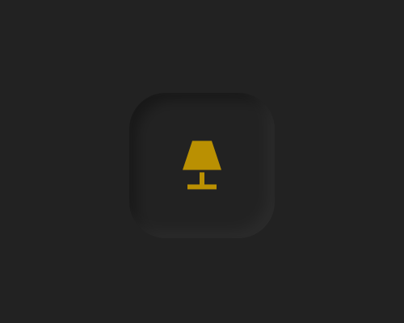
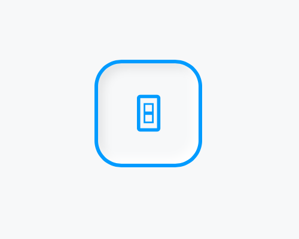
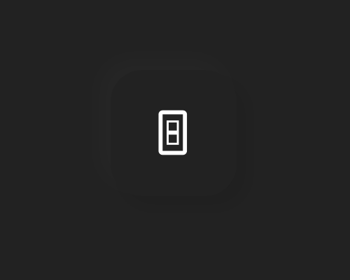
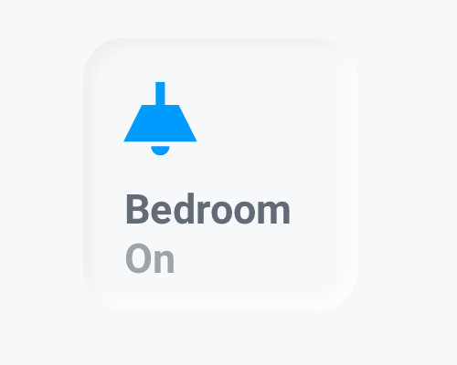
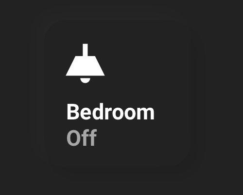
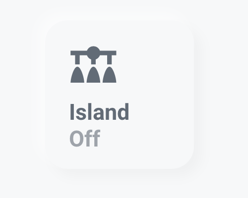
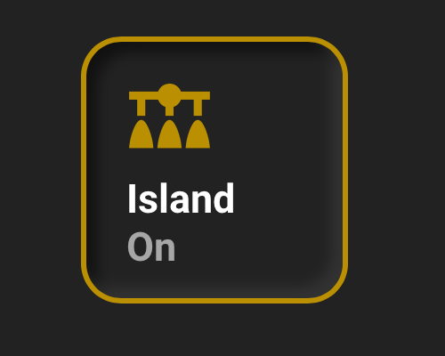
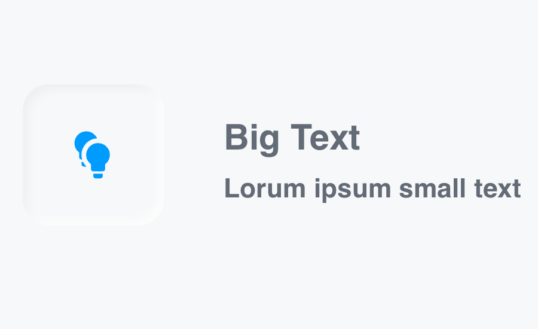
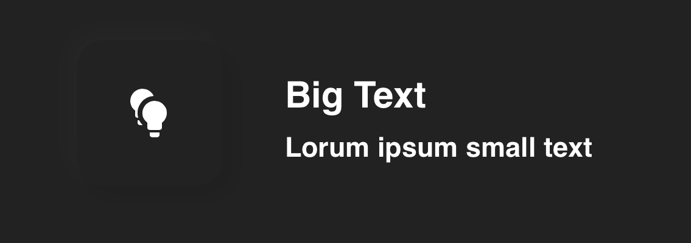

# Lovelace Soft UI 

[](https://github.com/N-l1/lovelace-soft-ui/blob/master/LICENSE) 
[](#) 
[](https://github.com/N-l1)

**Hello there!** Thank you for finding your way to my Home Assistant repo. Here you will find a simple, good looking, yet highly functional custom Neumorphic/Soft UI styled Lovelace. Enjoy!

[**Inspiration & examples!**](docs/inspiration.md) **|** [**Questions, help & discussions**](https://community.home-assistant.io/t/lovelace-soft-ui-simple-and-clean-lovelace-configuration)


# Let's do it!

### Alternatives
**[@Savjee](https://github.com/Savjee)'s [Button Text Card](https://github.com/Savjee/button-text-card).** If you are only looking to implement this style on a button, this is the way. It is very easy to install and set up. The downside, however, is that you will not be able to implement this style on any other card.

**[@KTibow](https://github.com/KTibow)'s [Soft UI themes](https://github.com/KTibow/lovelace-light-soft-ui-theme/).** If you are looking for a quick and simple way to implement this style universally to all your cards, this is the way. KTibow's themes are easier to implement, faster to set up, and will still work with any of the custom cards inside this repo. However, using the way described in this repo provides more flexibility and customizability. 

## 1. Install card-mod
First of all, you will need to install [card-mod](https://github.com/thomasloven/lovelace-card-mod). A custom card available on [HACS](https://hacs.xyz) (the Home Assistant Community Store). Card-mod is what we will use to style all the cards. Please follow HACS [documentation](https://hacs.xyz) and install it.

## 2. Custom Light and Dark Themes
The cards and styling in this repo are coded to be used with a light theme when the sun is up and a dark theme when the sun is down. Although Home Assistant provides a light and dark theme by default, this style works best with custom themes.

There are also custom themes available on [HACS](https://hacs.xyz). However, **please note that themes with pure white/black backgrounds will not work**. Light themes with a milky white background work well, and dark themes with a dark gray background work well.

All screenshots here are made with the [Clear](https://github.com/naofireblade/clear-theme) and [Slate](https://github.com/seangreen2/slate_theme) theme by [**@naofireblade**](https://github.com/naofireblade) and [**@seangreen2**](https://github.com/seangreen2) (both are available on HACS). If you decide to use the Clear theme, please make sure to remove the `lovelace-background` line from the theme's source code (located at `config/themes/clear/clear.yaml`).

Now that you have custom light and dark themes, we have to tell Home Assistant to switch to them at sunset and sunrise. To do this, first, make sure that your device and browser support dark mode detection, and you are on Home Assistant 0.114 or above. If not, see the **Alternative setup** section below. 

You will now need to make two service calls in Home Assistant. In the sidebar select Developer Tools and then navigate to the services tab and select `frontend.set_theme` from the service dropdown. In the Service Data field enter the following and modify as required. You will have to call the service twice, once for your light theme and once for your dark theme.

```yaml
name: name of your theme
mode: light # or dark
```

### Alternative setup

Alternatively, after picking out custom light and dark themes, you can just add the following into your `automations.yaml`.

<details><summary><b>Show code</b></summary>

```yaml
# Example automations.yaml entry
- id: set_theme
  alias: Set Theme
  trigger:
  - platform: homeassistant
    event: start
  - platform: state
    entity_id: sun.sun
  action:
  - choose:
    - conditions:
      - condition: state
        entity_id: sun.sun
        state: "above_horizon"
      sequence:
      - service: frontend.set_theme
        data:
          name: Change this to the name of your light theme
    - conditions:
      - condition: state
        entity_id: sun.sun
        state: "below_horizon"
      sequence:
      - service: frontend.set_theme
        data:
          name: Change this to the name of your dark theme
```
</details>

## 3. Done!
We are done! Add this code to any card config to style it with Soft UI. 

```yaml
# Example entry
style: |
  ha-card {
      background-color: var(--primary-background-color);
      border-radius: 15px;
      margin: 10px;
      box-shadow:
        
          -4px -4px 8px rgba(255, 255, 255, .5), 5px 5px 8px rgba(0, 0, 0, .03);
        
          -5px -5px 8px rgba(50, 50, 50, .2), 5px 5px 8px rgba(0, 0, 0, .08);
        
   }
```

# Advanced Usage
Here are some cards created using this style. Add them using the UI. Click on the three dots on the top right, go to `Configure UI`, then click on the `+` on the bottom right, and select `Manual`. Paste in the appropriate code for each card.

## Text Cards
**All text cards below require:**
* [**Card Mod**](https://github.com/thomasloven/lovelace-card-mod), by [**@thomasloven**](https://github.com/thomasloven)

### Heading
<p align="left">
  
  
  <br/>
</p>

This card displays texts with transparent background.

<details><summary><b>Show code</b></summary>

```yaml
# Example entry
content: |
  # Enter what you want to display here
style:
  .: |
    ha-card {
      --ha-card-background: none !important;
      box-shadow: none !important;
    }
  ha-markdown:
    $: |
      h1 {
        font-size: 20px;
        font-weight: bold;
        font-family: Helvetica;
        letter-spacing: '-0.01em';
      }
type: markdown
```
</details>

### Heading and Subheading

<p align="left">
  
  
  <br/>
</p>

This card displays texts with smaller texts underneath with transparent background.

<details><summary><b>Show code</b></summary>

```yaml
# Example entry
cards:
  - content: |
      # Enter what you want to display here
    style:
      .: |
        ha-card {
          --ha-card-background: none !important;
          box-shadow: none !important;
          height: 20px;
        }
      ha-markdown:
        $: |
          h1 {
            font-size: 20px;
            font-weight: bold;
            font-family: Helvetica;
            letter-spacing: '-0.01em';
          }
    type: markdown
  - content: |
      # Enter what you want to display in the small text
    style:
      .: |
        ha-card {
          --ha-card-background: none !important;
          box-shadow: none !important;
          height: 50px;
        }
      ha-markdown:
        $: |
          h1 {
            font-size: 15px;
            font-weight: thin;
            font-family: Helvetica;
            letter-spacing: '-0.01em';
          }
    type: markdown
type: vertical-stack
```
</details>

## Button Cards
Below you will find different button variations using the Soft UI style. All the buttons can be placed in a ```horizontal-stack```,```vertical-stack```, or ```grid``` card to form rows or columns of buttons (as seen in some of the screenshots). The button cards with borders are inspired by [**@hawk**](https://community.home-assistant.io/u/hawk/summary)'s beautiful [dashboard](https://community.home-assistant.io/t/lovelace-soft-ui-simple-and-clean-lovelace-configuration/159357/203).

**All button cards below require:**

* [**Button Card**](https://github.com/custom-cards/button-card), by [**@RomRider**](https://github.com/RomRider)

### Button, No Text, No Border
<p align="left">
  
  
  <br/>
</p>

This card is a simple button with an icon. When the state of the entity is `on`, the button will be pressed in (picture on the right). When the entity is `off` the button will be released (picture on the left). 

<details><summary><b>Show code</b></summary>

```yaml
# Example entry
entity: light.example # Change this to the entity you want to control
icon: 'mdi:lamp' # Change this to the icon you want to display
show_icon: true
show_name: false
styles:
  card:
    - width: 60px
    - height: 60px
    - margin: 10px
    - border-radius: 15px
    - box-shadow: |
        [[[ return states['sun.sun'].state == 'below_horizon'
          ? '-5px -5px 8px rgba(50, 50, 50, .2), 5px 5px 8px rgba(0, 0, 0, .08)'
          : '-4px -4px 8px rgba(255, 255, 255, .5), 5px 5px 8px rgba(0, 0, 0, .03)';
        ]]]
    - background-color: var(--primary-background-color)
  icon:
    - color: var(--primary-text-color)
state:
  - value: 'on'
    styles:
      card:
        - box-shadow: |
            [[[ return states['sun.sun'].state == 'below_horizon'
              ? 'inset -3px -3px 5px rgba(50, 50, 50, .5), inset 3px 3px 5px rgba(0, 0, 0, .3)'
              : 'inset -3px -3px 5px rgba(255, 255, 255, .65), inset 3px 3px 5px rgba(0, 0, 0, .035)';
            ]]]
      icon:
        - color: var(--paper-item-icon-active-color)
tap_action:
  action: toggle
  haptic: light
hold_action:
  action: more-info
  haptic: medium
type: 'custom:button-card'
```
</details>

### Button, No Text, With Border
<p align="left">
  
  
  <br/>
</p>

This card is almost identical to the one above. The only difference being when it is pressed, there is a border surrounding it (picture on the left).

<details><summary><b>Show code</b></summary>

```yaml
# Example entry
entity: light.example # Change this to the entity you want to control
icon: 'mdi:light-switch' # Change this to the icon you want to display
show_icon: true
show_name: false
triggers_update:
  - sun.sun
styles:
  card:
    - width: 60px
    - height: 60px
    - margin: 10px
    - border-radius: 15px
    - border-width: 1px
    - border-style: solid
    - border-color: var(--primary-background-color)
    - box-shadow: |
        [[[ return states['sun.sun'].state == 'below_horizon'
          ? '-5px -5px 8px rgba(50, 50, 50, .2), 5px 5px 8px rgba(0, 0, 0, .08)'
          : '-4px -4px 8px rgba(255, 255, 255, .5), 5px 5px 8px rgba(0, 0, 0, .03)';
        ]]]
    - background-color: var(--primary-background-color)
  icon:
    - color: var(--primary-text-color)
state:
  - value: 'on'
    styles:
      card:
        - border-width: 2px
        - box-shadow: |
            [[[ return states['sun.sun'].state == 'below_horizon'
              ? 'inset -4px -4px 5px rgba(60, 60, 60, .6), inset 4px 4px 5px rgba(0, 0, 0, .5)'
              : 'inset -3px -3px 5px rgba(255, 255, 255), inset 3px 3px 5px rgba(0, 0, 0, .08)';
            ]]]
        - border-color: var(--paper-item-icon-active-color)
      icon:
        - color: var(--paper-item-icon-active-color)
tap_action:
  action: toggle
  haptic: light
hold_action:
  action: more-info
  haptic: medium
type: 'custom:button-card'
```
</details>

### Button, With Text, No Border
<p align="left">
  
  
  <br/>
</p>

This button will display the icon, the name, and the state of the entity. It acts the same as the first button.

<details><summary><b>Show code</b></summary>

```yaml
# Example entry
entity: light.example # Change this to the entity you want to control
icon: 'mdi:ceiling-light' # Change this to the icon you want to display
name: Bedroom # Change this to the name you want to display
size: 35% # You can adjust the size of the icon
styles:
  img_cell:
    - padding-left: 15px # You can adjust padding of the icon
    - justify-content: start
  card:
    - margin: 10px
    - width: min(25vw, 100px)
    - height: min(25vw, 100px)
    - border-radius: 15px
    - box-shadow: |
        [[[ return states['sun.sun'].state == 'below_horizon'
          ? '-5px -5px 10px rgba(50, 50, 50, .2), 6px 6px 10px rgba(0, 0, 0, .08)'
          : '-5px -5px 8px rgba(255, 255, 255, .5), 5px 5px 8px rgba(0, 0, 0, .03)';
        ]]]
    - background-color: var(--primary-background-color)
  icon:
    - color: var(--primary-text-color)
  grid:
    - grid-template-areas: '"i" "n" "s"'
    - grid-template-columns: 1fr
    - grid-template-rows: 1fr min-content min-content
  name:
    - justify-self: start
    - font-weight: bold
    - font-size: 15px
    - padding-left: 15px
  state:
    - justify-self: start
    - font-weight: bold
    - font-size: 15px
    - opacity: 0.6
    - padding: 0 15px 5px
show_state: true
state:
  - value: 'on'
    styles:
      card:
        - box-shadow: |
            [[[ return states['sun.sun'].state == 'below_horizon'
              ? 'inset -3px -3px 5px rgba(50, 50, 50, .5), inset 3px 3px 5px rgba(0, 0, 0, .3)'
              : 'inset -3px -3px 5px rgba(255, 255, 255, .65), inset 3px 3px 5px rgba(0, 0, 0, .035)';
            ]]]
      icon:
        - color: var(--paper-item-icon-active-color)
tap_action:
  action: toggle
  haptic: light
hold_action:
  action: more-info
  haptic: medium
type: 'custom:button-card'
```
</details>

### Button, With Text and Border
<p align="left">
  
  
  <br/>
</p>

This card is almost identical to the one above. The only difference being when it is pressed, there is a border surrounding it (picture on the right).

<details><summary><b>Show code</b></summary>

```yaml
# Example entry
entity: light.example # Change this to the entity you want to control
icon: 'mdi:vanity-light' # Change this to the icon you want to display
name: Island # Change this to the name you want to display
size: 30% # You can adjust the size of the icon
styles:
  img_cell:
    - padding-left: 25px # You can adjust padding of the icon
    - justify-content: start
  card:
    - width: min(25vw, 100px)
    - height: min(25vw, 100px)
    - border-radius: 15px
    - border-style: solid
    - border-color: var(--primary-background-color)
    - border-width: 1px
    - margin: 10px
    - box-shadow: |
        [[[ return states['sun.sun'].state == 'below_horizon'
          ? '-5px -5px 8px rgba(50, 50, 50, .2), 5px 5px 8px rgba(0, 0, 0, .08)'
          : '-4px -4px 8px rgba(255, 255, 255, .5), 5px 5px 8px rgba(0, 0, 0, .03)';
        ]]]
    - background-color: var(--primary-background-color)
  icon:
    - color: var(--primary-text-color)
  grid:
    - grid-template-areas: '"i" "n" "s"'
    - grid-template-columns: 1fr
    - grid-template-rows: 1fr min-content min-content
  name:
    - justify-self: start
    - font-weight: bold
    - font-size: 15px
    - padding-left: 15px
  state:
    - justify-self: start
    - font-weight: bold
    - font-size: 15px
    - opacity: 0.6
    - padding: 0 15px 5px
show_state: true
state:
  - value: 'on'
    styles:
      card:
        - border-width: 2px
        - box-shadow: |
            [[[ return states['sun.sun'].state == 'below_horizon'
              ? 'inset -4px -4px 5px rgba(60, 60, 60, .6), inset 4px 4px 5px rgba(0, 0, 0, .5)'
              : 'inset -3px -3px 5px rgba(255, 255, 255), inset 3px 3px 5px rgba(0, 0, 0, .08)';
            ]]]
        - border-color: var(--paper-item-icon-active-color)
      icon:
        - color: var(--paper-item-icon-active-color)
tap_action:
  action: toggle
  haptic: light
hold_action:
  action: more-info
  haptic: medium
type: 'custom:button-card'
```
</details>

### Button, With Description
<p align="left">
  
  
  <br/>
</p>

**This card requires:**
* [**Card Mod**](https://github.com/thomasloven/lovelace-card-mod), by [**@thomasloven**](https://github.com/thomasloven)
* [**Button Card**](https://github.com/custom-cards/button-card), by [**@RomRider**](https://github.com/RomRider)

Same pressed in and released function as the other button cards. However, this button is bigger, along with two lines of text next to it that are customizable.

<details><summary><b>Show code</b></summary>

```yaml
# Example entry
cards:
  - entity: light.example # Change this to the entity you want to control
    icon: 'mdi:lightbulb-multiple' # Change this to the icon you want to display
    show_icon: true
    show_name: false
    state:
      - value: 'on'
        styles:
          card:
            - box-shadow: |
                [[[ return states['sun.sun'].state == 'below_horizon'
                  ? 'inset -4px -4px 5px rgba(60, 60, 60, .6), inset 4px 4px 5px rgba(0, 0, 0, .5)'
                  : 'inset -3px -3px 5px rgba(255, 255, 255), inset 3px 3px 5px rgba(0, 0, 0, .08)';
                ]]]
          icon:
            - color: var(--paper-item-icon-active-color)
    styles:
      card:
        - width: 80px
        - height: 80px
        - margin: 10px
        - border-radius: 15px
        - box-shadow: |
            [[[ return states['sun.sun'].state == 'below_horizon'
              ? '-5px -5px 10px rgba(50, 50, 50, .2), 6px 6px 10px rgba(0, 0, 0, .08)'
              : '-5px -5px 8px rgba(255, 255, 255, .5), 5px 5px 8px rgba(0, 0, 0, .03)';
            ]]]
        - background-color: var(--primary-background-color)
      icon:
        - color: var(--primary-text-color)
      # Actions to perform
      tap_action:
        action: toggle
        haptic: light
      hold_action:
        action: more-info
        haptic: medium
    type: 'custom:button-card'
  - cards:
      - content: |
          # Big text to display
        style:
          .: |
            ha-card {
              --ha-card-background: none !important;
              box-shadow: none !important;
              height: 20px;
              margin-top: 15px;
            }
          ha-markdown:
            $: |
              h1 {
                font-size: 20px;
                font-weight: bold;
                font-family: Helvetica;
                letter-spacing: '-0.01em';
              }
        type: markdown
      - content: >
          # Small text to display
        style:
          .: |
            ha-card {
              --ha-card-background: none !important;
              box-shadow: none !important;
            }
          ha-markdown:
            $: |
              h1 {
                font-size: 15px;
                font-weight: thin;
                font-family: Helvetica;
                letter-spacing: '-0.01em';
              }
        type: markdown
    type: vertical-stack
type: horizontal-stack
```
</details>

## Remote Card
<p align="left">
  
  
  <br/>
</p>

This card mimics a TV remote. Each button is customizable to execute your desired actions. 

**Required Custom Cards:**

* [**Button Card**](https://github.com/custom-cards/button-card), by [**@RomRider**](https://github.com/RomRider)
* [**Card Mod**](https://github.com/thomasloven/lovelace-card-mod), by [**@thomasloven**](https://github.com/thomasloven)

<details><summary><b>Show code</b></summary>

```yaml
# Example entry
entities:
  - cards:
      - icon: 'mdi:power'
        show_icon: true
        show_name: false
        style: |
          ha-card {
            box-shadow:
              
                -5px -5px 8px rgba(255, 255, 255, .5), 5px 5px 8px rgba(0, 0, 0, .03);
              
                -5px -5px 8px rgba(50, 50, 50, .2), 5px 5px 8px rgba(0, 0, 0, .08);
              
          }
        styles:
          card:
            - width: 60px
            - height: 60px
            - margin: 10px 10px 10px 155px
            - border-radius: 100px
            - background-color: var(--primary-background-color)
          icon:
            - color: var(--primary-text-color)
        tap_action: # Please change this to a service you call to toggle the TV/device
          action: call-service
          service: remote.send_command
          service_data:
            command: power
            entity_id: remote.xiaomi
        type: 'custom:button-card'
    type: 'custom:hui-horizontal-stack-card'
  - cards:
      - entities:
          - cards:
              - icon: 'mdi:menu-up'
                show_icon: true
                show_name: false
                size: 100%
                styles:
                  card:
                    - margin-left: 69px
                    - box-shadow: none
                    - width: 50px
                    - height: 50px
                    - background-color: var(--primary-background-color)
                  icon:
                    - color: var(--primary-text-color)
                tap_action: # Please change this to a service you call to go 'up' on the TV/device
                  action: call-service
                  service: remote.send_command
                  service_data:
                    command: up
                    entity_id: remote.xiaomi
                type: 'custom:button-card'
            type: 'custom:hui-horizontal-stack-card'
          - cards:
              - icon: 'mdi:menu-left'
                show_icon: true
                show_name: false
                size: 100%
                styles:
                  card:
                    - margin-left: 11px
                    - box-shadow: none
                    - width: 50px
                    - height: 50px
                    - background-color: var(--primary-background-color)
                  icon:
                    - color: var(--primary-text-color)
                tap_action: # Please change this to a service you call to go 'left' on the TV/device
                  action: call-service
                  service: remote.send_command
                  service_data:
                    command: left
                    entity_id: remote.xiaomi
                type: 'custom:button-card'
              - name: OK
                show_icon: false
                show_name: true
                style: |
                  ha-card {
                    box-shadow:
                      
                        -5px -5px 8px rgba(255, 255, 255, .5), 5px 5px 8px rgba(0, 0, 0, .03);
                      
                        -5px -5px 8px rgba(50, 50, 50, .2), 5px 5px 8px rgba(0, 0, 0, .08);
                      
                  }
                styles:
                  card:
                    - width: 50px
                    - height: 50px
                    - border-radius: 100px
                    - background-color: var(--primary-background-color)
                  name:
                    - font-size: 20px
                    - font-weight: bold
                    - font-family: Helvetica
                    - letter-spacing: '-0.01em'
                tap_action: # Please change this to a service you call to 'enter' on the TV/device
                  action: call-service
                  service: remote.send_command
                  service_data:
                    command: enter
                    entity_id: remote.xiaomi
                type: 'custom:button-card'
              - icon: 'mdi:menu-right'
                show_icon: true
                show_name: false
                size: 100%
                styles:
                  card:
                    - box-shadow: none
                    - width: 50px
                    - height: 50px
                    - background-color: var(--primary-background-color)
                  icon:
                    - color: var(--primary-text-color)
                tap_action: # Please change this to a service you call to go 'right' on the TV/device
                  action: call-service
                  service: remote.send_command
                  service_data:
                    command: right
                    entity_id: remote.xiaomi
                type: 'custom:button-card'
            type: 'custom:hui-horizontal-stack-card'
          - cards:
              - icon: 'mdi:menu-down'
                show_icon: true
                show_name: false
                size: 100%
                styles:
                  card:
                    - margin-left: 69px
                    - box-shadow: none
                    - width: 50px
                    - height: 50px
                    - background-color: var(--primary-background-color)
                  icon:
                    - color: var(--primary-text-color)
                tap_action: # Please change this to a service you call to go 'down' on the TV/device
                  action: call-service
                  service: remote.send_command
                  service_data:
                    command: down
                    entity_id: remote.xiaomi
                type: 'custom:button-card'
            type: 'custom:hui-horizontal-stack-card'
        show_header_toggle: false
        style: |
          ha-card {
            box-shadow:
              
                inset -3px -3px 5px rgba(255, 255, 255, .65), inset 3px 3px 5px rgba(0, 0, 0, .035);
              
                inset -3px -3px 5px rgba(50, 50, 50, .5), inset 3px 3px 5px rgba(0, 0, 0, .3);
              
            border-radius: 30px;
            background-color: var(--primary-background-color)
          }
        type: 'custom:hui-entities-card'
    type: 'custom:hui-horizontal-stack-card'
  - show_icon: false
    show_name: false
    style: |
      ha-card {
        --ha-card-background: none !important;
        box-shadow: none !important;
      }
    styles:
      card:
        - width: 10px
        - height: 10px
    type: 'custom:button-card'
  - cards:
      - entities:
          - cards:
              - icon: 'mdi:minus'
                show_icon: true
                show_name: false
                size: 100%
                styles:
                  card:
                    - margin-left: 30px
                    - box-shadow: none
                    - width: 30px
                    - height: 30px
                    - background-color: var(--primary-background-color)
                  icon:
                    - color: var(--primary-text-color)
                tap_action: # Please change this to a service you call to 'volume down' on the TV/device
                  action: call-service
                  service: remote.send_command
                  service_data:
                    command: volume_down_sony
                    entity_id: remote.xiaomi
                type: 'custom:button-card'
              - name: VOL
                show_icon: false
                show_name: true
                styles:
                  card:
                    - margin-left: 10px
                    - box-shadow: none
                    - width: 30px
                    - height: 30px
                    - border-radius: 100px
                    - background-color: var(--primary-background-color)
                  name:
                    - font-size: 13px
                    - font-weight: bold
                    - font-family: Helvetica
                    - letter-spacing: '-0.01em'
                type: 'custom:button-card'
              - icon: 'mdi:plus'
                show_icon: true
                show_name: false
                size: 100%
                styles:
                  card:
                    - margin-left: 10px
                    - box-shadow: none
                    - width: 30px
                    - height: 30px
                    - background-color: var(--primary-background-color)
                  icon:
                    - color: var(--primary-text-color)
                tap_action: # Please change this to a service you call to 'volume up' on the TV/device
                  action: call-service
                  service: remote.send_command
                  service_data:
                    command: volume_up_sony
                    entity_id: remote.xiaomi
                type: 'custom:button-card'
            type: 'custom:hui-horizontal-stack-card'
        show_header_toggle: false
        style: |
          ha-card {
            background-color: var(--primary-background-color);
            border-radius: 15px;
            box-shadow:
              
                -5px -5px 8px rgba(255, 255, 255, .5), 5px 5px 8px rgba(0, 0, 0, .03);
              
                -5px -5px 8px rgba(50, 50, 50, .2), 5px 5px 8px rgba(0, 0, 0, .08);
              
          }
        type: 'custom:hui-entities-card'
    type: 'custom:hui-horizontal-stack-card'
  - cards:
      - icon: 'mdi:home' # The first button in the bottom, you can change the icon here. In my case it is 'home'
        show_icon: true
        show_name: false
        style: |
          ha-card {
            box-shadow:
              
                -5px -5px 8px rgba(255, 255, 255, .5), 5px 5px 8px rgba(0, 0, 0, .03);
              
                -5px -5px 8px rgba(50, 50, 50, .2), 5px 5px 8px rgba(0, 0, 0, .08);
              
          }
        styles:
          card:
            - margin-top: 10px
            - margin-left: 5px
            - width: 60px
            - height: 60px
            - border-radius: 15px
            - background-color: var(--primary-background-color)
          icon:
            - color: var(--primary-text-color)
        tap_action: # Please change this to a service you want to call on the first button
          action: call-service
          service: remote.send_command
          service_data:
            command: home
            entity_id: remote.xiaomi
        type: 'custom:button-card'
      - icon: 'mdi:keyboard-return' # The second button in the bottom, you can change the icon here. In my case it is 'return'
        show_icon: true
        show_name: false
        style: |
          ha-card {
            box-shadow:
              
                -5px -5px 8px rgba(255, 255, 255, .5), 5px 5px 8px rgba(0, 0, 0, .03);
              
                -5px -5px 8px rgba(50, 50, 50, .2), 5px 5px 8px rgba(0, 0, 0, .08);
              
          }
        styles:
          card:
            - margin-top: 10px
            - margin-left: 8px
            - width: 60px
            - height: 60px
            - border-radius: 15px
            - background-color: var(--primary-background-color)
          icon:
            - color: var(--primary-text-color)
        tap_action: # Please change this to a service you want to call on the second button
          action: call-service
          service: remote.send_command
          service_data:
            command: return
            entity_id: remote.xiaomi
        type: 'custom:button-card'
      - icon: 'mdi:set-top-box' # The third button in the bottom, you can change the icon here. In my case it is a set top box.
        show_icon: true
        show_name: false
        style: |
          ha-card {
            box-shadow:
              
                -5px -5px 8px rgba(255, 255, 255, .5), 5px 5px 8px rgba(0, 0, 0, .03);
              
                -5px -5px 8px rgba(50, 50, 50, .2), 5px 5px 8px rgba(0, 0, 0, .08);
              
          }
        styles:
          card:
            - margin-top: 10px
            - margin-left: 8px
            - width: 60px
            - height: 60px
            - border-radius: 15px
            - background-color: var(--primary-background-color)
          icon:
            - color: var(--primary-text-color)
        tap_action: # Change this to a service you want to call on the third button
          action: call-service
          service: script.turn_on
          service_data:
            entity_id: script.mi_box
        type: 'custom:button-card'
    type: 'custom:hui-horizontal-stack-card'
show_header_toggle: false
style: |
  ha-card {
    background-color: var(--primary-background-color);
    width: 250px;
    border-radius: 10px;
    margin: 10px auto;
    box-shadow:
      
        -5px -5px 8px rgba(255, 255, 255, .5), 5px 5px 8px rgba(0, 0, 0, .03);
      
        -5px -5px 8px rgba(50, 50, 50, .2), 5px 5px 8px rgba(0, 0, 0, .08);
      
  }
type: entities
```
</details>

## Thank you!

Developed, maintained, and based on the Lovelace of [**@N-l1**](https://github.com/N-l1) & [**@KTibow**](https://github.com/KTibow) ✨
