# Lovelace Soft UI 
 

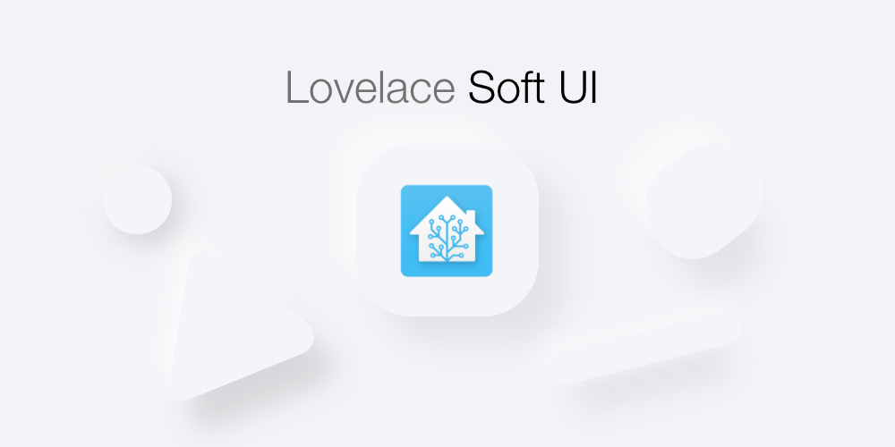

## Introduction

First and foremost **thank you** for finding you way to my Home Assistant repo. This is my [Home Assistant](https://github.com/home-assistant/home-assistant) Lovelace user interface configuration. I've been using Home Assistant for a little less than a year now (not so long), and it has brought me a huge amount of joy! This repo is to inspire and potentially be implemented into you UI! **Enjoy**! 

## Lovelace UI
Lovelace is the primary interface for Home Assistant, it is used to display all sorts of information. My take on Lovelace is for it to be **simple**. I'm trying to make it easy for **you** to implement my UI into yours! Look below for further details. 

My theme of the UI is based on [Soft UI](https://dribbble.com/shots/8027871-Soft-UI/attachments/531358?mode=media)

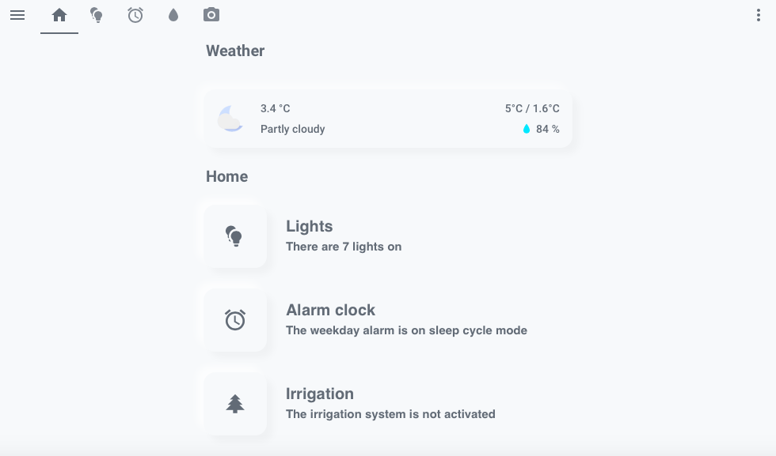

### Advanced Users
Thanks for taking you time to visit my repo! I have posted the yaml for my Lovelace above, I have also listed the custom cards I used below. If you require further assistance, please check below.

# Prerequisites
This is the first part of the **step by step guide**. 

These are some of the things you need before getting started.

## Custom Cards
You will need the following custom cards to be installed, it is easily done via [**HACS**](https://hacs.xyz). Please read HACS documentations and install the following cards.

#### Required

* [**Custom Header**](https://github.com/maykar/custom-header), by **@maykar**
* [**Button Card**](https://github.com/custom-cards/button-card), by **@RomRider**
* [**Card Mod**](https://github.com/thomasloven/lovelace-card-mod), by **@thomasloven**

#### Optional

* [**Search Card**](https://github.com/postlund/search-card) and [**Card Tools**](https://github.com/thomasloven/lovelace-card-tools), by **@postlund** and **@thomasloven**
* [**Simple Weather Card**](https://github.com/kalkih/simple-weather-card), by **@kalkih**
* [**Mini Media Player**](https://github.com/kalkih/mini-media-player), by **@kalkih**
* [**Mini Graph Card**](https://github.com/kalkih/mini-graph-card), also by **@kalkih**

## sun.sun
For the cards to switch automatically to a dark/light theme, please make sure you have the sun.sun entity (should come preinstalled). If you don't have it please add the following to your `configuration.yaml`.

``` markdown
# Example configuration.yaml entry
sun:
```
# Themes
Themes can also be installed with [HACS](https://hacs.xyz), manual installation docs are [here](https://www.home-assistant.io/integrations/frontend/). **@JuanMTech** also made a great [video](https://www.youtube.com/watch?v=3Xpd4zB2eRM) explaining how to setup themes. 

## Light Themes
Any light theme consisting a **milky white background** should work.

**Please note the background cannot be pure white.**

<p align="left">
  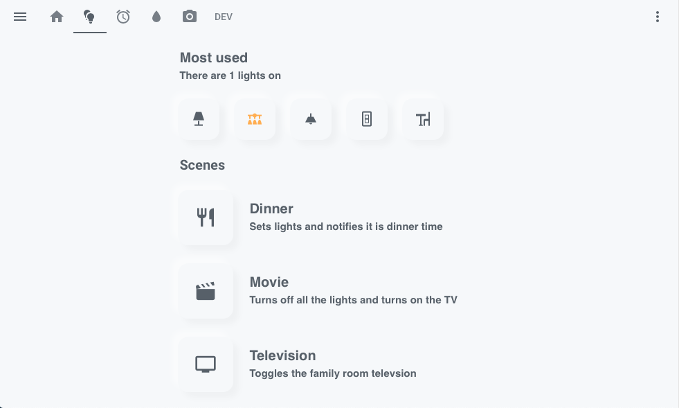
  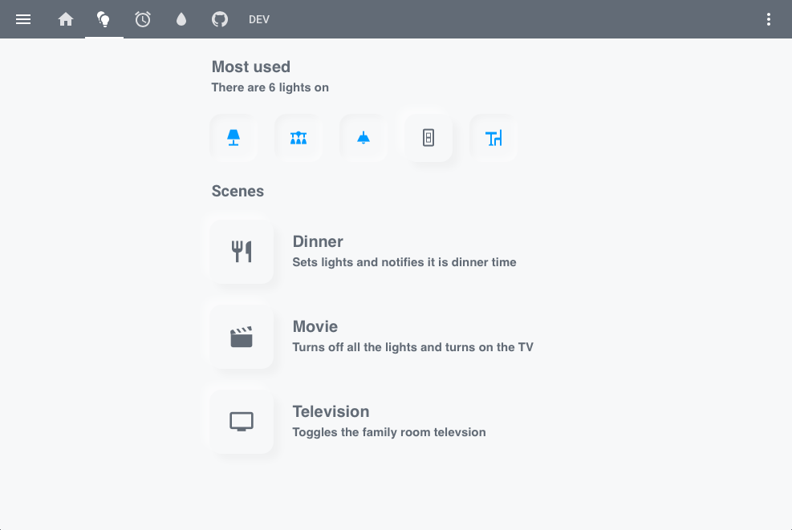
  <br>
  <a href="https://github.com/liri/lovelace-themes"><b>Google Home Light theme</b></a> and
  <a href="https://github.com/naofireblade/clear-theme"><b>Clear theme</b></a>, by <b>@liri</b> and <b>@naofireblade</b>
</p>

## Dark Themes
Any dark theme consisting a **dark grey/black background** should work.

**Please note the background of the theme cannot be compeletly black.** 

The following themes are available in [**HACS**](https://hacs.xyz).

<p align="left">
  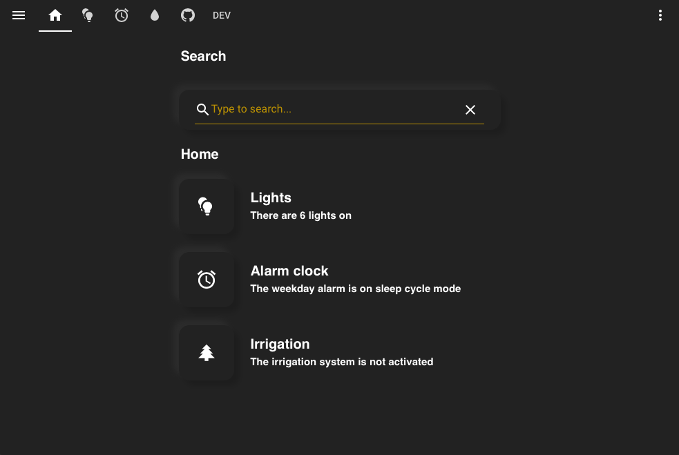
  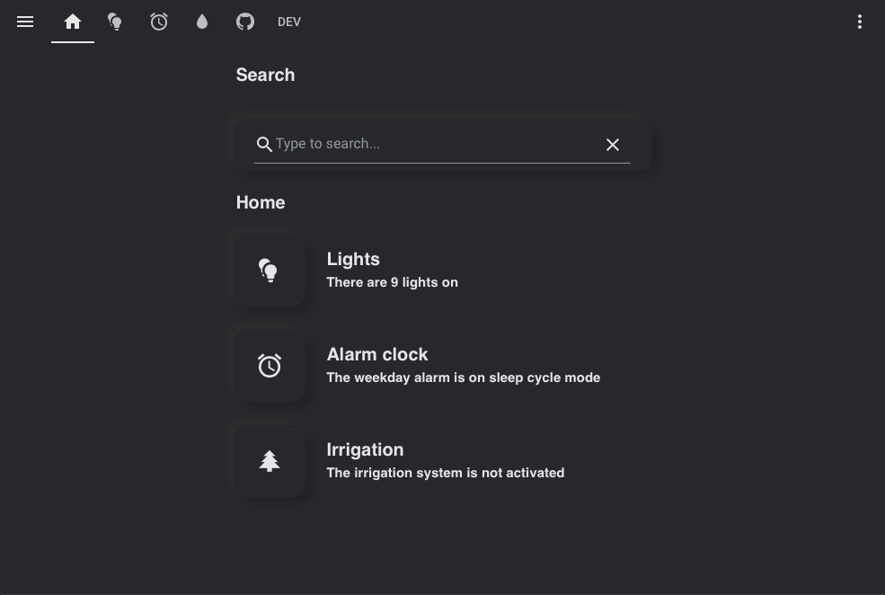
  <br>
  <a href="https://github.com/seangreen2/slate_theme"><b>Slate theme</b></a> and <a href="https://github.com/home-assistant-community-themes/grey-night"><b>Grey Night theme</b></a>, by <b>@seangreen2</b> and <b>@ksya</b>
</p>
<p align="left">
  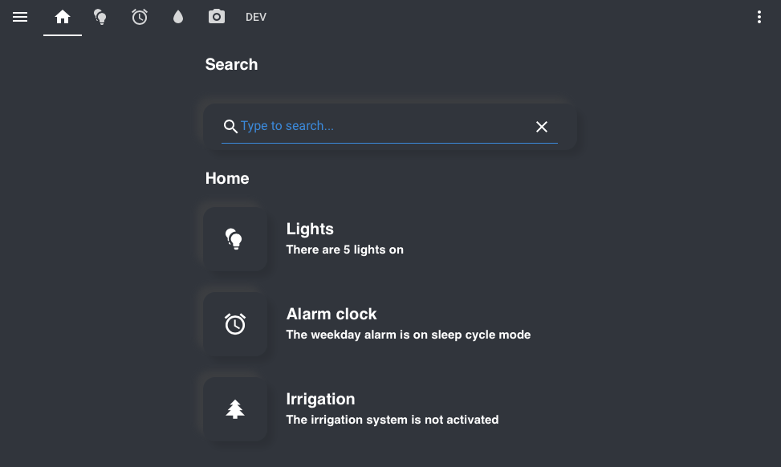
  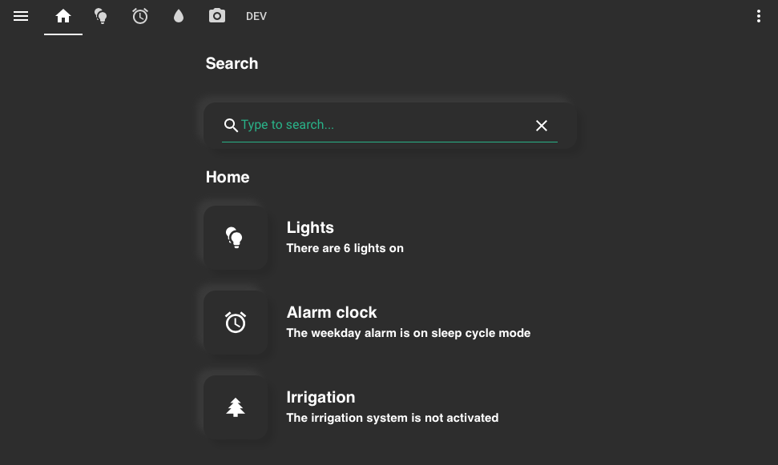
  <br>
  <a href="https://github.com/home-assistant-community-themes/midnight"><b>Midnight theme</b></a> and <a href="https://github.com/home-assistant-community-themes/dark-mint"><b>Dark Mint theme</b></a>, by <b>@Marcel Hoffs</b> and <b>@lambtho</b>
</p>

## Comapct Header
You can either have the header match the background color or display it's own color.
</p>
<p align="left">
  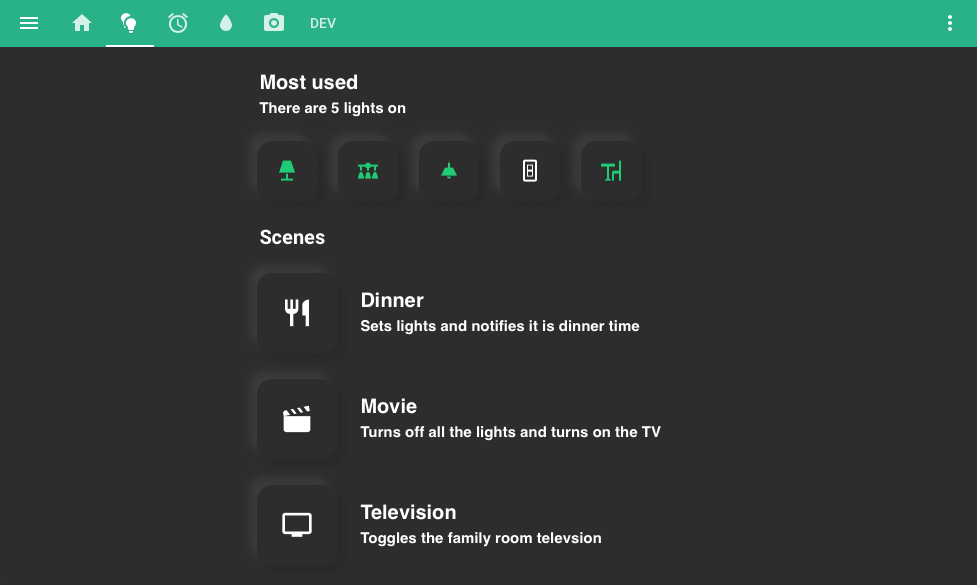
  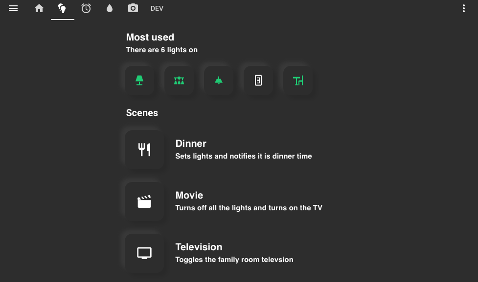
  <br>
  <a href="https://github.com/home-assistant-community-themes/dark-mint"><b>Dark Mint theme</b></a> header with and without color.
</p>

Click on the three dots on the top right, then go to `Configure UI` then `Raw config editor`. 

Add the following if you would like the header to match the background color:

``` markdown
# Example entry
custom_header:
  background: var(--primary-background-color);
  compact_mode: true
```
Only add the following if you would like the header to display it's own color:

``` markdown
# Example entry
custom_header:
  compact_mode: true
```

# Cards
Finally we've arrived on how to configure the cards themselves.

## Text Header Card
</p>
<p align="left">
  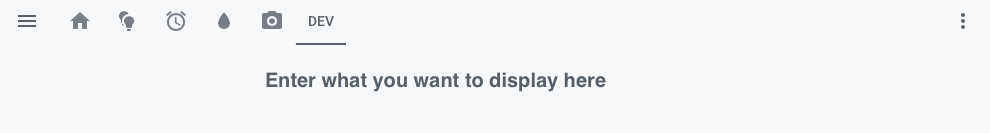
  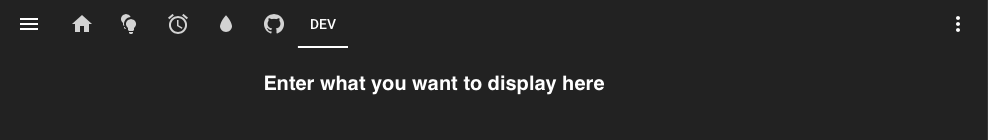
  <br>
  <b>Text header cards</b> with the <b>Light</b> and <b>Dark</b> themes.
</p>

To add this card, click on the three dots on the top right, then go to `Configure UI` then click on the `+` on the bottom right, then select `MANUAL CARD` . 

Add the following:

``` markdown
# Example entry
cards:
  - cards:
      - content: |
          # Enter what you want to display here
        style: |
          ha-card {
             --paper-card-background-color: 'rgba(11, 11, 11, 0.00)';
             box-shadow: 2px 2px rgba(0,0,0,0.0);
          }
          h1 {
            font-size: 20px;
            font-weight: bold;
            font-family: Helvetica;
            letter-spacing: '-0.01em';
          }
        type: markdown
    type: vertical-stack
type: vertical-stack
```
## Text Header Card with Subheader
</p>
<p align="left">
  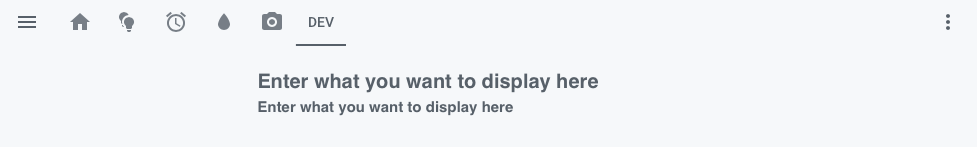
  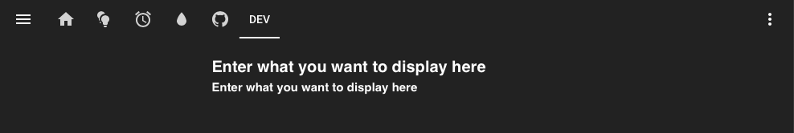
  <br>
  <b>Text header cards with subheader</b> with the <b>Light</b> and <b>Dark</b> themes.
</p>

To add this card, click on the three dots on the top right, then go to `Configure UI` then click on the `+` on the bottom right, then select `MANUAL CARD` . 

Add the following:

``` markdown
# Example entry
cards:
  - cards:
      - content: |
          # Enter what you want to display here
        style: |
          ha-card {
             --paper-card-background-color: 'rgba(11, 11, 11, 0.00)';
             box-shadow: 2px 2px rgba(0,0,0,0.0);
          }
          h1 {cards:
  - cards:
      - content: |
          # Enter what you want to display here
        style: |
          ha-card {
             --paper-card-background-color: 'rgba(11, 11, 11, 0.00)';
             box-shadow: 2px 2px rgba(0,0,0,0.0);
          }
          h1 {
            font-size: 20px;
            font-weight: bold;
            font-family: Helvetica;
            letter-spacing: '-0.01em';
          }
        type: markdown
      - content: |
          # Enter what you want to display here
        style: |
          ha-card {
               height: 50px;
               --paper-card-background-color: 'rgba(11, 11, 11, 0.00)';
               box-shadow: 2px 2px rgba(0,0,0,0.0);
                 }
             h1 {
                  font-size: 15px;
                  font-weight: thin;
                  font-family: Helvetica;
                  letter-spacing: '-0.01em';
                }
        type: markdown
    type: vertical-stack
type: vertical-stack


            font-size: 20px;
            font-weight: bold;
            font-family: Helvetica;
            letter-spacing: '-0.01em';
          }
        type: markdown
    type: vertical-stack
type: vertical-stack
```

## Horizontal Buttons Card
</p>
<p align="left">
  
  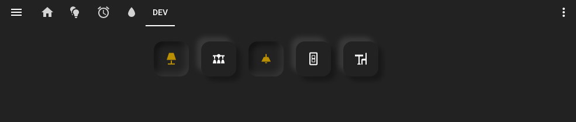
  <br>
  <b>Horizontal buttons card</b> with the <b>Light</b> and <b>Dark</b> themes.
</p>

To add this card, click on the three dots on the top right, then go to `Configure UI` then click on the `+` on the bottom right, then select `MANUAL CARD` . 

Add the following:

``` markdown
# Example entry
cards:
  - cards:
      - show_icon: false
        show_name: false
        style: |
          ha-card {
            --paper-card-background-color: 'rgba(11, 11, 11, 0.00)';
            box-shadow: 2px 2px rgba(0,0,0,0.0);
          }
        styles:
          card:
            - width: 5px
            - height: 10px
        type: 'custom:button-card'
      - cards:
          - show_icon: false
            show_name: false
            style: |
              ha-card {
                --paper-card-background-color: 'rgba(11, 11, 11, 0.00)';
                box-shadow: 2px 2px rgba(0,0,0,0.0);
              }
            styles:
              card:
                - width: 5px
                - height: 80px
            type: 'custom:button-card'
          - icon: 'mdi:lightbulb-multiple'
            show_icon: true
            show_name: false
            style: |
              ha-card {
                box-shadow: 
                  
                    -8px -8px 8px 0 rgba(255,255,255,.5),8px 8px 8px 0 rgba(0,0,0,.03);
                  
                    -8px -8px 8px 0 rgba(77, 77, 77,.5),8px 8px 8px 0 rgba(0,0,0,.1);
                                  
              }
            styles:
              card:
                - width: 80px
                - height: 80px
                - border-radius: 15px
                - background-color: var(--primary-background-color)
              icon:
                - color: var(--primary-text-color)
            tap_action:
              action: navigate
              navigation_path: /lovelace/lights
            type: 'custom:button-card'
          - cards:
              - content: |
                  # Lights
                style: |
                  ha-card {
                    height: 20px;                  
                    --paper-card-background-color: 'rgba(11, 11, 11, 0.00)';
                    box-shadow: 2px 2px rgba(0,0,0,0.0);
                  }
                  h1 {
                    font-size: 20px;
                    font-weight: bold;
                    font-family: Helvetica;
                    letter-spacing: '-0.01em';
                  }
                type: markdown
              - content: >
                  # There are  
                  currently no    {{states('sensor.lights_on')}}   lights on
                style: |
                  ha-card {
                  --paper-card-background-color: 'rgba(11, 11, 11, 0.00)';
                  box-shadow: 2px 2px rgba(0,0,0,0.0);
                     }
                  h1 {
                    font-size: 15px;
                    font-weight: thin;
                    font-family: Helvetica;
                    letter-spacing: '-0.01em';
                  }
                type: markdown
            type: vertical-stack
        type: horizontal-stack
      - show_icon: false
        show_name: false
        style: |
          ha-card {
            --paper-card-background-color: 'rgba(11, 11, 11, 0.00)';
            box-shadow: 2px 2px rgba(0,0,0,0.0);
          }
        styles:
          card:
            - width: 5px
            - height: 10px
        type: 'custom:button-card'
      - cards:
          - show_icon: false
            show_name: false
            style: |
              ha-card {
                 --paper-card-background-color: 'rgba(11, 11, 11, 0.00)';
                 box-shadow: 2px 2px rgba(0,0,0,0.0);
              }
            styles:
              card:
                - width: 5px
                - height: 80px
            type: 'custom:button-card'
          - icon: 'mdi:alarm'
            show_icon: true
            show_name: false
            style: |
              ha-card {
                box-shadow: 
                  
                    -8px -8px 8px 0 rgba(255,255,255,.5),8px 8px 8px 0 rgba(0,0,0,.03);
                  
                    -8px -8px 8px 0 rgba(77, 77, 77,.5),8px 8px 8px 0 rgba(0,0,0,.1);
                     
              }
            styles:
              card:
                - width: 80px
                - height: 80px
                - border-radius: 15px
                - background-color: var(--primary-background-color)
              icon:
                - color: var(--primary-text-color)
            tap_action:
              action: navigate
              navigation_path: /lovelace/alarm
            type: 'custom:button-card'
          - cards:
              - content: |
                  # Alarm clock
                style: |
                  ha-card {
                    height: 20px;                  
                    --paper-card-background-color: 'rgba(11, 11, 11, 0.00)';
                    box-shadow: 2px 2px rgba(0,0,0,0.0);
                  }
                  h1 {
                    font-size: 20px;
                    font-weight: bold;
                    font-family: Helvetica;
                    letter-spacing: '-0.01em';
                  }
                type: markdown
              - content: >
                  # The weekday alarm is    on
                  sleep cycle mode      set
                  for {{states('sensor.alarm_weekday_time')}}    not
                  set  
                style: |
                  ha-card {
                    --paper-card-background-color: 'rgba(11, 11, 11, 0.00)';
                    box-shadow: 2px 2px rgba(0,0,0,0.0);
                  }
                  h1 {
                    font-size: 15px;
                    font-weight: thin;
                    font-family: Helvetica;
                    letter-spacing: '-0.01em';
                  }
                type: markdown
            type: vertical-stack
        type: horizontal-stack
      - show_icon: false
        show_name: false
        style: |
          ha-card {
            --paper-card-background-color: 'rgba(11, 11, 11, 0.00)';
            box-shadow: 2px 2px rgba(0,0,0,0.0);
          }
        styles:
          card:
            - width: 5px
            - height: 10px
        type: 'custom:button-card'
      - cards:
          - show_icon: false
            show_name: false
            style: |
              ha-card {
              --paper-card-background-color: 'rgba(11, 11, 11, 0.00)';
               box-shadow: 2px 2px rgba(0,0,0,0.0);
              }
            styles:
              card:
                - width: 5px
                - height: 80px
            type: 'custom:button-card'
          - icon: 'mdi:pine-tree'
            show_icon: true
            show_name: false
            style: |
              ha-card {
                box-shadow: 
                  
                    -8px -8px 8px 0 rgba(255,255,255,.5),8px 8px 8px 0 rgba(0,0,0,.03);
                  
                    -8px -8px 8px 0 rgba(77, 77, 77,.5),8px 8px 8px 0 rgba(0,0,0,.1);
                     
              }
            styles:
              card:
                - width: 80px
                - height: 80px
                - border-radius: 15px
                - background-color: var(--primary-background-color)
              icon:
                - color: var(--primary-text-color)
            tap_action:
              action: navigate
              navigation_path: /lovelace/sprinklers/
            type: 'custom:button-card'
          - cards:
              - content: |
                  # Irrigation
                style: |
                  ha-card {
                    height: 20px;                  
                    --paper-card-background-color: 'rgba(11, 11, 11, 0.00)';
                    box-shadow: 2px 2px rgba(0,0,0,0.0);
                  }
                  h1 {
                    font-size: 20px;
                    font-weight: bold;
                    font-family: Helvetica;
                    letter-spacing: '-0.01em';
                  }
                type: markdown
              - content: |
                  # The irrigation system is not activated
                style: |
                  ha-card {
                  --paper-card-background-color: 'rgba(11, 11, 11, 0.00)';
                  box-shadow: 2px 2px rgba(0,0,0,0.0);
                     }
                   h1 {
                   
                   font-size: 15px;
                   font-weight: thin;
                   font-family: Helvetica;
                   letter-spacing: '-0.01em';
                      }
                type: markdown
            type: vertical-stack
        type: horizontal-stack
      - show_icon: false
        show_name: false
        style: |
          ha-card {
            --paper-card-background-color: 'rgba(11, 11, 11, 0.00)';
            box-shadow: 2px 2px rgba(0,0,0,0.0);
          }
        styles:
          card:
            - width: 5px
            - height: 10px
        type: 'custom:button-card'
      - cards:
          - show_icon: false
            show_name: false
            style: |
              ha-card {
                --paper-card-background-color: 'rgba(11, 11, 11, 0.00)';
                box-shadow: 2px 2px rgba(0,0,0,0.0);
              }
            styles:
              card:
                - width: 5px
                - height: 10px
            type: 'custom:button-card'
        type: horizontal-stack
    type: vertical-stack
type: vertical-stack
```
