# Lovelace Soft UI 
#### A new user friendly, simple and clean Lovelace configuration

 


## Introduction

First and foremost thank you for finding your way to my Home Assistant repo. This is my [Home Assistant](https://github.com/home-assistant/home-assistant) Lovelace user interface configuration. I've been using Home Assistant for a little less than a year now (not so long), and it has brought me a huge amount of joy!

Lovelace is the primary interface for Home Assistant, it is used to display all sorts of information. Sometimes though an excessive amount of information is displayed. My take on Lovelace is for it to be simple and drew some inspiration from [Soft UI](https://dribbble.com/shots/8027871-Soft-UI/attachments/531358?mode=media). I've tried to make this easy enough for even a very new user to able to implement it :) 

**Home Assistant forum discussions are** [**here**](https://community.home-assistant.io/t/lovelace-soft-ui-simple-and-clean-lovelace-configuration) 

Here are some pictures:


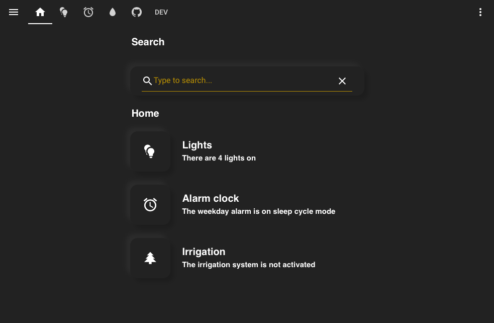
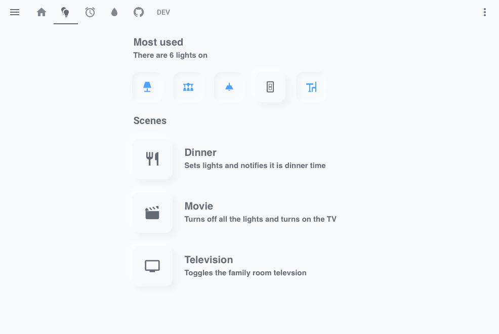
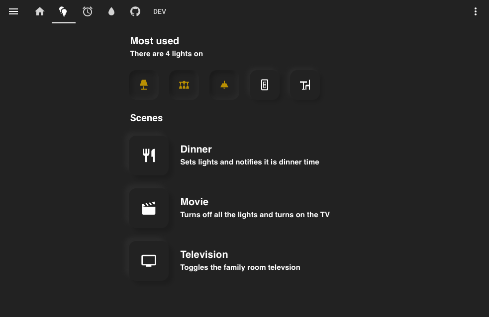
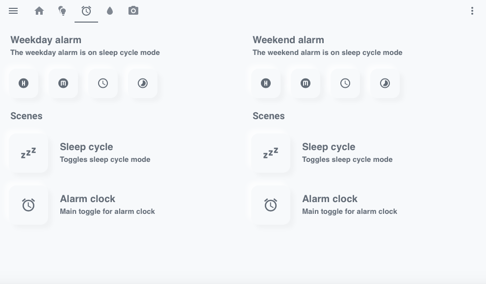
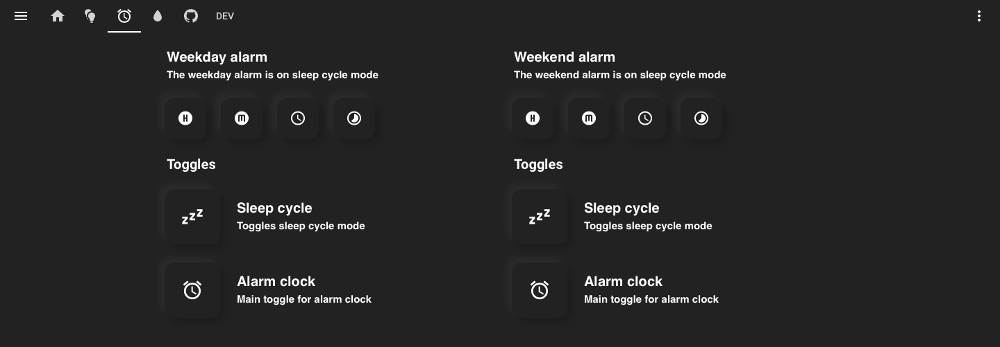

# Prerequisites
This is the first part of the **step by step guide**. 

**Please note I have posted my YAML above, if you prefer that instead.**

These are some of the things you need before getting started.

## Custom Cards
You will need the following custom cards to be installed, it is easily done via [**HACS**](https://hacs.xyz). Please read HACS documentations and install the following cards.

<details><summary><b>Click here</b></summary>
<p>
  
#### Required

* [**Custom Header**](https://github.com/maykar/custom-header), by **@maykar**
* [**Button Card**](https://github.com/custom-cards/button-card), by **@RomRider**
* [**Card Mod**](https://github.com/thomasloven/lovelace-card-mod), by **@thomasloven**

#### Optional

* [**Search Card**](https://github.com/postlund/search-card) and [**Card Tools**](https://github.com/thomasloven/lovelace-card-tools), by **@postlund** and **@thomasloven**
* [**Simple Weather Card**](https://github.com/kalkih/simple-weather-card), by **@kalkih**
* [**Mini Media Player**](https://github.com/kalkih/mini-media-player), by **@kalkih**
* [**Mini Graph Card**](https://github.com/kalkih/mini-graph-card), also by **@kalkih**
</p>
</details>


## sun.sun
For the cards to switch automatically to a dark/light theme, please make sure you have the sun.sun entity (should come preinstalled). If you don't have it please add the following to your `configuration.yaml`.

``` markdown
# Example configuration.yaml entry
sun:
```
## Theme Switching Automation
You would need to have an automation setup for automatically switching to a dark theme at sunset and back to a light them at sunrise. If you don't have one please add the following to your `automations.yaml`.

<details><summary><b>Click here</b></summary>
<p>

``` markdown
# Example automations.yaml entry
- alias: "Light theme after Sunrise"
  trigger:
    platform: sun
    event: sunrise
  action:
    - service: frontend.set_theme
      data:
# Change this to the name of your light theme
        name: Light

- alias: "Dark theme after Sunset"
  trigger:
    platform: sun
    event: sunset
  action:
    - service: frontend.set_theme
      data:
# Change this to the name of your dark theme
        name: Dark

- alias: 'Light theme after reboot in day'
  trigger:
    platform: homeassistant
    event: start
  condition:
    - condition: state
      entity_id: sun.sun
      state: 'above_horizon'
  action:
    service: frontend.set_theme
    data:
# Change this to the name of your light theme
      name: Light

- alias: 'Dark theme after reboot in night'
  trigger:
    platform: homeassistant
    event: start
  condition:
    condition: state
    entity_id: sun.sun
    state: 'below_horizon'
  action:
    service: frontend.set_theme
    data:
# Change this to the name of your dark theme
      name: Dark
```
</p>
</details>

# Themes
This is the second part of the **step by step guide**. 

Themes can also be installed with [HACS](https://hacs.xyz), manual installation docs are [here](https://www.home-assistant.io/integrations/frontend/). **@JuanMTech** also made a great [video](https://www.youtube.com/watch?v=3Xpd4zB2eRM) explaining how to setup themes. 

## Light Themes
Any light theme consisting a **milky white background** should work.

**Please note the background cannot be pure white.**

<p align="left">
  
  
  <br>
  <a href="https://github.com/liri/lovelace-themes"><b>Google Home Light theme</b></a> and
  <a href="https://github.com/naofireblade/clear-theme"><b>Clear theme</b></a>, by <b>@liri</b> and <b>@naofireblade</b>
</p>

## Dark Themes
Any dark theme consisting a **dark grey/black background** should work.

**Please note the background of the theme cannot be completely black.** 

The following themes are available in [**HACS**](https://hacs.xyz).

<p align="left">
  
  
  <br>
  <a href="https://github.com/seangreen2/slate_theme"><b>Slate theme</b></a> and <a href="https://github.com/home-assistant-community-themes/grey-night"><b>Grey Night theme</b></a>, by <b>@seangreen2</b> and <b>@ksya</b>

## Compact Header
You can either have the header match the background color or display it's own color.
</p>
<p align="left">
  
  
  <br>
  <a href="https://github.com/seangreen2/slate_theme"><b>Slate theme</b></a> header with and without color.
</p>

Click on the three dots on the top right, then go to `Configure UI` then `Raw config editor`. 

Add the following if you would like the header to match the background color:

``` markdown
# Example entry
custom_header:
  background: var(--primary-background-color);
  compact_mode: true
```
Only add the following if you would like the header to display it's own color:

``` markdown
# Example entry
custom_header:
  compact_mode: true
```

# Cards
This is the third part of the **step by step guide**. 

Finally we've arrived on how to configure the cards themselves. All the cards below will be able to adjust to dark/light themes depending on if the sun is above or below the horizon.

**The following adding of cards uses the UI editor. If you use YAML mode, my YAML is above.**

To add cards using the UI editor, click on the three dots on the top right, then go to `Configure UI` then click on the `+` on the bottom right, then select `MANUAL CARD` 

Paste in the appropriate text for each card.

## Text Header Card
</p>
<p align="left">
  
  
  <br>
  <b>Text header cards</b> with the <b>Light</b> and <b>Dark</b> themes.
</p>

#### Custom cards needed

* [**Card Mod**](https://github.com/thomasloven/lovelace-card-mod), by **@thomasloven**

This card displays a text with transparent background.

Add the following:

<details><summary><b>Click here</b></summary>
<p>

``` markdown
# Example entry
cards:
  - cards:
# Enter what you want to display
      - content: |
          # Enter what you want to display here
        style: |
          ha-card {
             --paper-card-background-color: 'rgba(11, 11, 11, 0.00)';
             box-shadow: 2px 2px rgba(0,0,0,0.0);
          }
          h1 {
            font-size: 20px;
            font-weight: bold;
            font-family: Helvetica;
            letter-spacing: '-0.01em';
          }
        type: markdown
    type: vertical-stack
type: vertical-stack
```
</p>
</details>

## Text Header Card with Subheader
</p>
<p align="left">
  
  
  <br>
  <b>Text header cards with subheader</b> with the <b>Light</b> and <b>Dark</b> themes.
</p>

#### Custom cards needed

* [**Card Mod**](https://github.com/thomasloven/lovelace-card-mod), by **@thomasloven**

This card displays a text with smaller text underneath with transparent background.

Add the following:

<details><summary><b>Click here</b></summary>
<p>

``` markdown
# Example entry
cards:
  - cards:
# Enter what you want to display
      - content: |
          # Enter what you want to display here
        style: |
          ha-card {
            height: 20px;
            --paper-card-background-color: 'rgba(11, 11, 11, 0.00)';
            box-shadow: 2px 2px rgba(0,0,0,0.0);
          }
          h1 {
            font-size: 20px;
            font-weight: bold;
            font-family: Helvetica;
            letter-spacing: '-0.01em';
          }
        type: markdown
# Enter what you want to display in the small text
      - content: |
          # Enter what you want to display here
        style: |
          ha-card {
               height: 50px;
               --paper-card-background-color: 'rgba(11, 11, 11, 0.00)';
               box-shadow: 2px 2px rgba(0,0,0,0.0);
                 }
             h1 {
                  font-size: 15px;
                  font-weight: thin;
                  font-family: Helvetica;
                  letter-spacing: '-0.01em';
                }
        type: markdown
    type: vertical-stack
type: vertical-stack
```
</p>
</details>

## Vertical Buttons Card
</p>
<p align="left">
  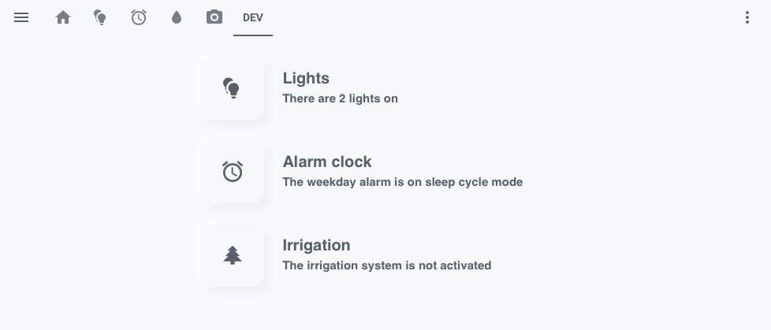
  
  <br>
  <b>Vertical buttons card</b> with the <b>Light</b> and <b>Dark</b> themes.
</p>

#### Custom cards needed

* [**Button Card**](https://github.com/custom-cards/button-card), by **@RomRider**
* [**Card Mod**](https://github.com/thomasloven/lovelace-card-mod), by **@thomasloven**

The following code will create three buttons: lights, alarm clock and irrigation. Each of the buttons will redirect you to a Lovelace tab with the corresponding name, i.e lovelace/lights. You can change the icons, names, redirect tabs, and texts beside them.

Add the following:

<details><summary><b>Click here</b></summary>
<p>

``` markdown
# Example entry
cards:
  - cards:
      - show_icon: false
        show_name: false
        style: |
          ha-card {
            --paper-card-background-color: 'rgba(11, 11, 11, 0.00)';
            box-shadow: 2px 2px rgba(0,0,0,0.0);
          }
        styles:
          card:
            - width: 5px
            - height: 10px
        type: 'custom:button-card'
      - cards:
          - show_icon: false
            show_name: false
            style: |
              ha-card {
                --paper-card-background-color: 'rgba(11, 11, 11, 0.00)';
                box-shadow: 2px 2px rgba(0,0,0,0.0);
              }
            styles:
              card:
                - width: 5px
                - height: 80px
            type: 'custom:button-card'
# This is first button with the light bulb icon
# Change this to an icon you want
          - icon: 'mdi:lightbulb-multiple'
            show_icon: true
            show_name: false
            style: |
              ha-card {
                box-shadow: 
                  
                    -8px -8px 8px 0 rgba(255,255,255,.5),8px 8px 8px 0 rgba(0,0,0,.03);
                  
                    -8px -8px 8px 0 rgba(50, 50, 50,.5),8px 8px 8px 0 rgba(0,0,0,.15);
                                   
              }
            styles:
              card:
                - width: 80px
                - height: 80px
                - border-radius: 15px
                - background-color: var(--primary-background-color)
              icon:
                - color: var(--primary-text-color)
            tap_action:
              action: navigate
# This is the tab that the first button redirects to 
# Change this to the tab you want the button to redirect to
              navigation_path: /lovelace/lights
            type: 'custom:button-card'
          - cards:
# This is the text beside the first button
# Change this to what you want it to say          
              - content: |
                  # Lights
                style: |
                  ha-card {
                    height: 20px;                  
                    --paper-card-background-color: 'rgba(11, 11, 11, 0.00)';
                    box-shadow: 2px 2px rgba(0,0,0,0.0);
                  }
                  h1 {
                    font-size: 20px;
                    font-weight: bold;
                    font-family: Helvetica;
                    letter-spacing: '-0.01em';
                  }
                type: markdown
# This is the smaller text beside the first button
# Change this to what you want it to say                
              - content: >              
                  # There are  
                  currently no    {{states('sensor.lights_on')}}   lights on
                style: |
                  ha-card {
                  --paper-card-background-color: 'rgba(11, 11, 11, 0.00)';
                  box-shadow: 2px 2px rgba(0,0,0,0.0);
                     }
                  h1 {
                    font-size: 15px;
                    font-weight: thin;
                    font-family: Helvetica;
                    letter-spacing: '-0.01em';
                  }
                type: markdown
            type: vertical-stack
        type: horizontal-stack
      - show_icon: false
        show_name: false
        style: |
          ha-card {
            --paper-card-background-color: 'rgba(11, 11, 11, 0.00)';
            box-shadow: 2px 2px rgba(0,0,0,0.0);
          }
        styles:
          card:
            - width: 5px
            - height: 10px
        type: 'custom:button-card'
      - cards:
          - show_icon: false
            show_name: false
            style: |
              ha-card {
                 --paper-card-background-color: 'rgba(11, 11, 11, 0.00)';
                 box-shadow: 2px 2px rgba(0,0,0,0.0);
              }
            styles:
              card:
                - width: 5px
                - height: 80px
            type: 'custom:button-card'
# This is second button with the alarm clock icon
# Change this to an icon you want
          - icon: 'mdi:alarm'
            show_icon: true
            show_name: false
            style: |
              ha-card {
                box-shadow: 
                  
                    -8px -8px 8px 0 rgba(255,255,255,.5),8px 8px 8px 0 rgba(0,0,0,.03);
                  
                    -8px -8px 8px 0 rgba(50, 50, 50,.5),8px 8px 8px 0 rgba(0,0,0,.15);
                      
              }
            styles:
              card:
                - width: 80px
                - height: 80px
                - border-radius: 15px
                - background-color: var(--primary-background-color)
              icon:
                - color: var(--primary-text-color)
            tap_action:
              action: navigate
# This is the tab that the second button redirects to 
# Change this to the tab you want the button to redirect to              
              navigation_path: /lovelace/alarm
            type: 'custom:button-card'
          - cards:
# This is the text beside the second button
# Change this to what you want it to say   
              - content: |           
                  # Alarm clock
                style: |
                  ha-card {
                    height: 20px;                  
                    --paper-card-background-color: 'rgba(11, 11, 11, 0.00)';
                    box-shadow: 2px 2px rgba(0,0,0,0.0);
                  }
                  h1 {
                    font-size: 20px;
                    font-weight: bold;
                    font-family: Helvetica;
                    letter-spacing: '-0.01em';
                  }
                type: markdown
# This is the smaller text beside the second button
# Change this to what you want it to say  
              - content: >            
                  # The weekday alarm is    on
                  sleep cycle mode      set
                  for {{states('sensor.alarm_weekday_time')}}    not
                  set  
                style: |
                  ha-card {
                    --paper-card-background-color: 'rgba(11, 11, 11, 0.00)';
                    box-shadow: 2px 2px rgba(0,0,0,0.0);
                  }
                  h1 {
                    font-size: 15px;
                    font-weight: thin;
                    font-family: Helvetica;
                    letter-spacing: '-0.01em';
                  }
                type: markdown
            type: vertical-stack
        type: horizontal-stack
      - show_icon: false
        show_name: false
        style: |
          ha-card {
            --paper-card-background-color: 'rgba(11, 11, 11, 0.00)';
            box-shadow: 2px 2px rgba(0,0,0,0.0);
          }
        styles:
          card:
            - width: 5px
            - height: 10px
        type: 'custom:button-card'
      - cards:
          - show_icon: false
            show_name: false
            style: |
              ha-card {
              --paper-card-background-color: 'rgba(11, 11, 11, 0.00)';
               box-shadow: 2px 2px rgba(0,0,0,0.0);
              }
            styles:
              card:
                - width: 5px
                - height: 80px
            type: 'custom:button-card'
# This is third button with the pine tree icon
# Change this to an icon you want            
          - icon: 'mdi:pine-tree'
            show_icon: true
            show_name: false
            style: |
              ha-card {
                box-shadow: 
                  
                    -8px -8px 8px 0 rgba(255,255,255,.5),8px 8px 8px 0 rgba(0,0,0,.03);
                  
                    -8px -8px 8px 0 rgba(50, 50, 50,.5),8px 8px 8px 0 rgba(0,0,0,.15);
                     
              }
            styles:
              card:
                - width: 80px
                - height: 80px
                - border-radius: 15px
                - background-color: var(--primary-background-color)
              icon:
                - color: var(--primary-text-color)
            tap_action:
              action: navigate
# This is the tab that the third button redirects to 
# Change this to the tab you want the button to redirect to
              navigation_path: /lovelace/sprinklers/
            type: 'custom:button-card'
          - cards:
# This is the text beside the third button
# Change this to what you want it to say 
              - content: |             
                  # Irrigation
                style: |
                  ha-card {
                    height: 20px;                  
                    --paper-card-background-color: 'rgba(11, 11, 11, 0.00)';
                    box-shadow: 2px 2px rgba(0,0,0,0.0);
                  }
                  h1 {
                    font-size: 20px;
                    font-weight: bold;
                    font-family: Helvetica;
                    letter-spacing: '-0.01em';
                  }
                type: markdown
# This is the smaller text beside the third button
# Change this to what you want it to say    
              - content: |          
                  # The irrigation system is not activated
                style: |
                  ha-card {
                  --paper-card-background-color: 'rgba(11, 11, 11, 0.00)';
                  box-shadow: 2px 2px rgba(0,0,0,0.0);
                     }
                   h1 {
                   
                   font-size: 15px;
                   font-weight: thin;
                   font-family: Helvetica;
                   letter-spacing: '-0.01em';
                      }
                type: markdown
            type: vertical-stack
        type: horizontal-stack
      - show_icon: false
        show_name: false
        style: |
          ha-card {
            --paper-card-background-color: 'rgba(11, 11, 11, 0.00)';
            box-shadow: 2px 2px rgba(0,0,0,0.0);
          }
        styles:
          card:
            - width: 5px
            - height: 10px
        type: 'custom:button-card'
      - cards:
          - show_icon: false
            show_name: false
            style: |
              ha-card {
                --paper-card-background-color: 'rgba(11, 11, 11, 0.00)';
                box-shadow: 2px 2px rgba(0,0,0,0.0);
              }
            styles:
              card:
                - width: 5px
                - height: 10px
            type: 'custom:button-card'
        type: horizontal-stack
    type: vertical-stack
type: vertical-stack
```
</p>
</details>

## Horizontal Buttons Card
</p>
<p align="left">
  
  
  <br>
  <b>Horizontal buttons card</b> with the <b>Light</b> and <b>Dark</b> themes.
</p>

#### Custom cards needed

* [**Button Card**](https://github.com/custom-cards/button-card), by **@RomRider**
* [**Card Mod**](https://github.com/thomasloven/lovelace-card-mod), by **@thomasloven**

The code below will setup five button cards horizontally (like the picture). When the state of the entity is 'on', the button will be depressed. When the entity is 'off' it will be released (like normal).

Add the following:

<details><summary><b>Click here</b></summary>
<p>

``` markdown
cards:
  - cards:
      - show_icon: false
        show_name: false
        style: |
          ha-card {
            --paper-card-background-color: 'rgba(11, 11, 11, 0.00)';
            box-shadow: 2px 2px rgba(0,0,0,0.0);
          }
        styles:
          card:
            - width: 5px
            - height: 10px
        type: 'custom:button-card'
      - cards:
          - cards:
              - show_icon: false
                show_name: false
                style: |
                  ha-card {
                  --paper-card-background-color: 'rgba(11, 11, 11, 0.00)';
                  box-shadow: 2px 2px rgba(0,0,0,0.0);
                  }
                styles:
                  card:
                    - width: 5px
                    - height: 60px
                type: 'custom:button-card'
# You can change the entity_id and icon of the first button here   
              - entity: switch.family_room_lamp
                icon: 'mdi:lamp'
                show_icon: true
                show_name: false
                state:
                  - styles:
                      icon:
                        - color: 'var(--paper-item-icon-active-color)  '
                    value: 'on'
# You also have to change the entity_ids in the following template
                style: |
                  ha-card {
                    box-shadow: 
                      
                        inset -4px -4px 8px 0 rgba(255,255,255,.5), inset 4px 4px 8px 0 rgba(0,0,0,.03);
                                            
                        -5px -5px 8px 0 rgba(255,255,255,.5),5px 5px 8px 0 rgba(0,0,0,.03);
                                            
                        inset -4px -4px 10px 0 rgba(50, 50, 50,.5), inset 4px 4px 12px 0 rgba(0,0,0,.3); 
                         
                        -5px -5px 8px 0 rgba(50, 50, 50,.5),5px 5px 8px 0 rgba(0,0,0,.15);
                                              
                  }
                styles:
                  card:
                    - width: 60px
                    - height: 60px
                    - border-radius: 15px
                    - background-color: var(--primary-background-color)
                  icon:
                    - color: var(--primary-text-color)
                tap_action:
                  action: toggle
                type: 'custom:button-card'
              - show_icon: false
                show_name: false
                style: |
                  ha-card {
                  --paper-card-background-color: 'rgba(11, 11, 11, 0.00)';
                  box-shadow: 2px 2px rgba(0,0,0,0.0);
                  }
                styles:
                  card:
                    - width: 5px
                    - height: 60px
                type: 'custom:button-card'
# You can change the entity_id and icon of the second button here   
              - entity: switch.kitchen_island_lights
                icon: 'mdi:vanity-light'
                show_icon: true
                show_name: false
                state:
                  - styles:
                      icon:
                        - color: 'var(--paper-item-icon-active-color)  '
                    value: 'on'
# You also have to change the entity_ids in the following template
                style: |
                  ha-card {
                    box-shadow: 
                      
                        inset -4px -4px 8px 0 rgba(255,255,255,.5), inset 4px 4px 8px 0 rgba(0,0,0,.03);
                                            
                        -5px -5px 8px 0 rgba(255,255,255,.5),5px 5px 8px 0 rgba(0,0,0,.03);
                                            
                        inset -4px -4px 10px 0 rgba(50, 50, 50,.5), inset 4px 4px 12px 0 rgba(0,0,0,.3); 
                         
                        -5px -5px 8px 0 rgba(50, 50, 50,.5),5px 5px 8px 0 rgba(0,0,0,.15);
                                               
                  }
                styles:
                  card:
                    - width: 60px
                    - height: 60px
                    - border-radius: 15px
                    - background-color: var(--primary-background-color)
                  icon:
                    - color: var(--primary-text-color)
                tap_action:
                  action: toggle
                type: 'custom:button-card'
              - show_icon: false
                show_name: false
                style: |
                  ha-card {
                  --paper-card-background-color: 'rgba(11, 11, 11, 0.00)';
                  box-shadow: 2px 2px rgba(0,0,0,0.0);
                  }
                styles:
                  card:
                    - width: 5px
                    - height: 60px
                type: 'custom:button-card'
# You can change the entity_id and icon of the third button here   
              - entity: switch.dining_area
                icon: 'mdi:ceiling-light'
                show_icon: true
                show_name: false
                state:
                  - styles:
                      icon:
                        - color: 'var(--paper-item-icon-active-color)  '
                    value: 'on'
# You also have to change the entity_ids in the following template
                style: |
                  ha-card {
                    box-shadow: 
                      
                        inset -4px -4px 8px 0 rgba(255,255,255,.5), inset 4px 4px 8px 0 rgba(0,0,0,.03);
                                            
                        -5px -5px 8px 0 rgba(255,255,255,.5),5px 5px 8px 0 rgba(0,0,0,.03);
                                            
                        inset -4px -4px 10px 0 rgba(50, 50, 50,.5), inset 4px 4px 12px 0 rgba(0,0,0,.3); 
                         
                        -5px -5px 8px 0 rgba(50, 50, 50,.5),5px 5px 8px 0 rgba(0,0,0,.15);
                                                 
                  }
                styles:
                  card:
                    - width: 60px
                    - height: 60px
                    - border-radius: 15px
                    - background-color: var(--primary-background-color)
                  icon:
                    - color: var(--primary-text-color)
                tap_action:
                  action: toggle
                type: 'custom:button-card'
              - show_icon: false
                show_name: false
                style: |
                  ha-card {
                  --paper-card-background-color: 'rgba(11, 11, 11, 0.00)';
                  box-shadow: 2px 2px rgba(0,0,0,0.0);
                  }
                styles:
                  card:
                    - width: 5px
                    - height: 60px
                type: 'custom:button-card'
# You can change the entity_id and icon of the fourth button here   
              - entity: light.family_room_dimmer
                icon: 'mdi:light-switch'
                show_icon: true
                show_name: false
                state:
                  - styles:
                      icon:
                        - color: 'var(--paper-item-icon-active-color)  '
                    value: 'on'
# You also have to change the entity_ids in the following template
                style: |
                  ha-card {
                    box-shadow: 
                      
                        inset -4px -4px 8px 0 rgba(255,255,255,.5), inset 4px 4px 8px 0 rgba(0,0,0,.03);
                                            
                        -5px -5px 8px 0 rgba(255,255,255,.5),5px 5px 8px 0 rgba(0,0,0,.03);
                                            
                        inset -4px -4px 10px 0 rgba(50, 50, 50,.5), inset 4px 4px 12px 0 rgba(0,0,0,.3); 
                         
                        -5px -5px 8px 0 rgba(50, 50, 50,.5),5px 5px 8px 0 rgba(0,0,0,.15);
                           
                  }
                styles:
                  card:
                    - width: 60px
                    - height: 60px
                    - border-radius: 15px
                    - background-color: var(--primary-background-color)
                  icon:
                    - color: var(--primary-text-color)
                tap_action:
                  action: toggle
                type: 'custom:button-card'
              - show_icon: false
                show_name: false
                style: |
                  ha-card {
                  --paper-card-background-color: 'rgba(11, 11, 11, 0.00)';
                  box-shadow: 2px 2px rgba(0,0,0,0.0);
                  }
                styles:
                  card:
                    - width: 5px
                    - height: 60px
                type: 'custom:button-card'
# You can change the entity_id and icon of the fifth button here 
              - entity: switch.dining_table
                icon: 'mdi:table-chair'
                show_icon: true
                show_name: false
                state:
                  - styles:
                      icon:
                        - color: 'var(--paper-item-icon-active-color)  '
                    value: 'on'
# You also have to change the entity_ids in the following template
                style: |
                  ha-card {
                    box-shadow: 
                      
                        inset -4px -4px 8px 0 rgba(255,255,255,.5), inset 4px 4px 8px 0 rgba(0,0,0,.03);
                                            
                        -5px -5px 8px 0 rgba(255,255,255,.5),5px 5px 8px 0 rgba(0,0,0,.03);
                                            
                        inset -4px -4px 10px 0 rgba(50, 50, 50,.5), inset 4px 4px 12px 0 rgba(0,0,0,.3); 
                         
                        -5px -5px 8px 0 rgba(50, 50, 50,.5),5px 5px 8px 0 rgba(0,0,0,.15);
                           
                  }
                styles:
                  card:
                    - width: 60px
                    - height: 60px
                    - border-radius: 15px
                    - background-color: var(--primary-background-color)
                  icon:
                    - color: var(--primary-text-color)
                tap_action:
                  action: toggle
                type: 'custom:button-card'
            type: horizontal-stack
        type: vertical-stack
      - show_icon: false
        show_name: false
        style: |
          ha-card {
            --paper-card-background-color: 'rgba(11, 11, 11, 0.00)';
            box-shadow: 2px 2px rgba(0,0,0,0.0);
          }
        styles:
          card:
            - width: 5px
            - height: 10px
        type: 'custom:button-card'
    type: vertical-stack
type: vertical-stack
```
</p>
</details>

## Text to Speech card
</p>
<p align="left">
  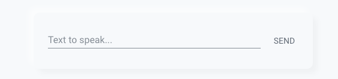
  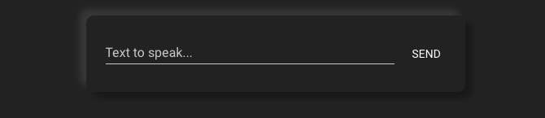
  <br>
  <b>Text to speech card</b> with the <b>Light</b> and <b>Dark</b> themes.
</p>

#### Custom cards needed

* [**Mini Media Player**](https://github.com/kalkih/mini-media-player), by **@kalkih**
* [**Card Mod**](https://github.com/thomasloven/lovelace-card-mod), by **@thomasloven**

The code below will setup a text input for you to TTS to a desired media player. If you require further assistance on this card, check the TTS section of the [Mini Media Player](https://github.com/kalkih/mini-media-player) card. 

Add the following:

<details><summary><b>Click here</b></summary>
<p>
  
``` markdown
# Example entry
type: vertical-stack
cards:
  - type: vertical-stack
    cards:
      - show_icon: false
        show_name: false
        style: |
          ha-card {
            --paper-card-background-color: 'rgba(11, 11, 11, 0.00)';
            box-shadow: 2px 2px rgba(0,0,0,0.0);
          }
        styles:
          card:
            - width: 5px
            - height: 5px
        type: 'custom:button-card'
      - type: horizontal-stack
        cards:
          - show_icon: false
            show_name: false
            style: |
              ha-card {
                --paper-card-background-color: 'rgba(11, 11, 11, 0.00)';
                box-shadow: 2px 2px rgba(0,0,0,0.0);
              }
            styles:
              card:
                - width: 5px
                - height: 5px
            type: 'custom:button-card'        
          - entities:
              - type: 'custom:mini-media-player'
# Change this the media player you want to TTS to              
                entity: media_player.echo_dot
                group: true
                hide:
                  name: true
                  icon: true
                  info: true
                  power: true
                  source: true
                  sound_mode: true
                  controls: true
                  play_pause: true
                  play_stop: true
                  volume: true
                  mute: true
                  progress: true
                  runtime: true
                  artwork_border: true
                  power_state: true
                  icon_state: true
                  shuffle: true
                tts:
# Change this to the platform for your TTS. 
# For example: tts.google_translate_say would be google_translate 
                  platform: alexa
            style: |
              ha-card {
                background-color: var(--primary-background-color);
                box-shadow:
                  
                    -8px -8px 8px 0 rgba(255,255,255,.5),8px 8px 8px 0 rgba(0,0,0,.03);
                  
                    -8px -8px 8px 0 rgba(50, 50, 50,.5),8px 8px 8px 0 rgba(0,0,0,.15);
                   
                border-radius: 10px;
              }
            show_header_toggle: false
            type: entities
          - show_icon: false
            show_name: false
            style: |
              ha-card {
                --paper-card-background-color: 'rgba(11, 11, 11, 0.00)';
                box-shadow: 2px 2px rgba(0,0,0,0.0);
              }
            styles:
              card:
                - width: 5px
                - height: 5px
            type: 'custom:button-card'
      - show_icon: false
        show_name: false
        style: |
          ha-card {
            --paper-card-background-color: 'rgba(11, 11, 11, 0.00)';
            box-shadow: 2px 2px rgba(0,0,0,0.0);
          }
        styles:
          card:
            - width: 5px
            - height: 5px 
        type: 'custom:button-card'           
```
</p>
</details>

## Remote pop-up card
</p>
<p align="left">
  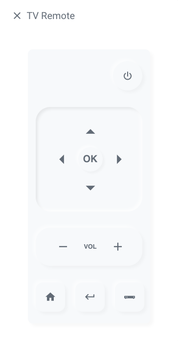
  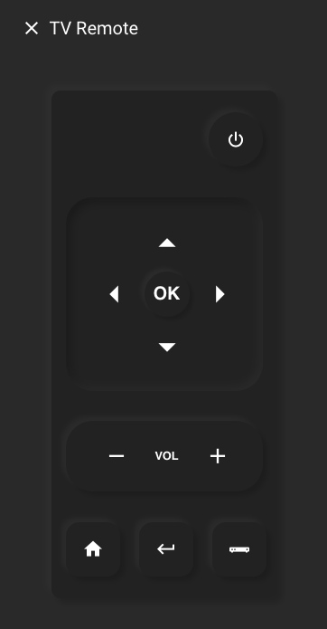
  <br>
  <b>Remote pop-up card</b> with the <b>Light</b> and <b>Dark</b> themes.
</p>

#### Custom cards needed

* [**Button Card**](https://github.com/custom-cards/button-card), by **@RomRider**
* [**Card Mod**](https://github.com/thomasloven/lovelace-card-mod), by **@thomasloven**

#### Custom components needed

* [**Browser Mod**](https://github.com/thomasloven/hass-browser_mod), by **@thomasloven**

This is a quite special card. Each button on it can be used to control your TV/device. It will pop up when you long press on an entity. For example, you can make it pop-up when you hold on your TV entity. 

To add this card, click on the three dots on the top right, then go to `Configure UI` then click the three dots on the top right again, then select `Raw config editor`  

Add the following to the first line:

<details><summary><b>Click here</b></summary>
<p>

``` markdown
popup_cards:
# Please change this to the entity you want to hold and get the remote
  script.television:
    title: Remote
    card:
      type: vertical-stack
      cards:
       - type: vertical-stack
         cards:
           - type: vertical-stack
             cards:
                - type: vertical-stack
                  cards:
                    - show_icon: false
                      show_name: false
                      style: |
                        ha-card {
                          --paper-card-background-color: 'rgba(11, 11, 11, 0.00)';
                          box-shadow: 2px 2px rgba(0,0,0,0.0);
                        }
                        styles:
                          card:
                            - width: 1px
                            - height: 1px
                      type: 'custom:button-card'
                    - cards:
                        - show_icon: false
                          show_name: false
                          style: |
                            ha-card {
                               --paper-card-background-color: 'rgba(11, 11, 11, 0.00)';
                               box-shadow: 2px 2px rgba(0,0,0,0.0);
                            }
                          styles:
                            card:
                              - width: 50px
                              - height: 60px
                          type: 'custom:button-card'
                        - entities:
                            - cards:
                                - show_icon: false
                                  show_name: false
                                  style: |
                                    ha-card {
                                      --paper-card-background-color: 'rgba(11, 11, 11, 0.00)';
                                      box-shadow: 2px 2px rgba(0,0,0,0.0);
                                    }
                                  styles:
                                    card:
                                      - width: 150px
                                      - height: 60px
                                  type: 'custom:button-card'
                                - icon: 'mdi:power'
                                  show_icon: true
                                  show_name: false
                                  style: |
                                    ha-card {
                                      box-shadow: 
                                        
                                          -5px -5px 5px 0 rgba(255,255,255,.5),5px 5px 5px 0 rgba(0,0,0,.03);
                                        
                                          -5px -5px 5px 0 rgba(50, 50, 50,.5),5px 5px 5px 0 rgba(0,0,0,.15);
                                                        
                                    }                
                                  styles:
                                    card:
                                      - width: 60px
                                      - height: 60px
                                      - border-radius: 100px
                                      - background-color: var(--primary-background-color)
                                    icon:
                                      - color: var(--primary-text-color)
                                  tap_action:
                                    action: call-service
# Please change this to a service you call to toggle the TV/device
                                    service: remote.send_command
                                    service_data:
                                      command: power
                                      entity_id: remote.xiaomi
                                  type: 'custom:button-card'
                                - show_icon: false
                                  show_name: false
                                  style: |
                                    ha-card {
                                      --paper-card-background-color: 'rgba(11, 11, 11, 0.00)';
                                      box-shadow: 2px 2px rgba(0,0,0,0.0);
                                    }
                                  styles:
                                    card:
                                      - width: 10px
                                      - height: 60px
                                  type: 'custom:button-card'
                              type: 'custom:hui-horizontal-stack-card'
                            - show_icon: false
                              show_name: false
                              style: |
                                ha-card {
                                  --paper-card-background-color: 'rgba(11, 11, 11, 0.00)';
                                  box-shadow: 2px 2px rgba(0,0,0,0.0);
                                }
                              styles:
                                card:
                                  - width: 10px
                                  - height: 10px
                              type: 'custom:button-card'
                            - cards:
                                - entities:
                                    - cards:
                                        - show_icon: false
                                          show_name: false
                                          style: |
                                            ha-card {
                                              --paper-card-background-color: 'rgba(11, 11, 11, 0.00)';
                                              box-shadow: 2px 2px rgba(0,0,0,0.0);
                                            }
                                          styles:
                                            card:
                                              - width: 63px
                                              - height: 10px
                                          type: 'custom:button-card'
                                        - icon: 'mdi:menu-up'
                                          show_icon: true
                                          show_name: false
                                          size: 100%
                                          styles:
                                            card:
                                              - box-shadow: none
                                              - width: 50px
                                              - height: 50px
                                              - background-color: var(--primary-background-color)
                                            icon:
                                              - color: var(--primary-text-color)
                                          tap_action:
                                            action: call-service
# Please change this to a service you call to go 'up' on the TV/device                                            
                                            service: remote.send_command
                                            service_data:
                                              command: up
                                              entity_id: remote.xiaomi
                                          type: 'custom:button-card'
                                      type: 'custom:hui-horizontal-stack-card'
                                    - cards:
                                        - show_icon: false
                                          show_name: false
                                          style: |
                                            ha-card {
                                              --paper-card-background-color: 'rgba(11, 11, 11, 0.00)';
                                              box-shadow: 2px 2px rgba(0,0,0,0.0);
                                            }
                                          styles:
                                            card:
                                              - width: 5px
                                              - height: 10px
                                          type: 'custom:button-card'
                                        - icon: 'mdi:menu-left'
                                          show_icon: true
                                          show_name: false
                                          size: 100%
                                          styles:
                                            card:
                                              - box-shadow: none
                                              - width: 50px
                                              - height: 50px
                                              - background-color: var(--primary-background-color)
                                            icon:
                                              - color: var(--primary-text-color)
                                          tap_action:
                                            action: call-service
# Please change this to a service you call to go 'left' on the TV/device                                              
                                            service: remote.send_command
                                            service_data:
                                              command: left
                                              entity_id: remote.xiaomi
                                          type: 'custom:button-card'
                                        - name: OK
                                          show_icon: false
                                          show_name: true
                                          style: |
                                            ha-card {
                                              box-shadow: 
                                                
                                                  -4px -4px 4px 0 rgba(255,255,255,.5),4px 4px 4px 0 rgba(0,0,0,.03);
                                                
                                                  -4px -4px 4px 0 rgba(50, 50, 50,.5),4px 4px 4px 0 rgba(0,0,0,.15);
                                                                
                                            }
                                          styles:
                                            card:
                                              - width: 50px
                                              - height: 50px
                                              - border-radius: 100px
                                              - background-color: var(--primary-background-color)
                                            name:
                                              - font-size: 20px
                                              - font-weight: bold
                                              - font-family: Helvetica
                                              - letter-spacing: '-0.01em'
                                          tap_action:
# Please change this to a service you call to 'enter' on the TV/device                                            
                                            action: call-service
                                            service: remote.send_command
                                            service_data:
                                              command: enter
                                              entity_id: remote.xiaomi
                                          type: 'custom:button-card'
                                        - icon: 'mdi:menu-right'
                                          show_icon: true
                                          show_name: false
                                          size: 100%
                                          styles:
                                            card:
                                              - box-shadow: none
                                              - width: 50px
                                              - height: 50px
                                              - background-color: var(--primary-background-color)
                                            icon:
                                              - color: var(--primary-text-color)
                                          tap_action:
                                            action: call-service
# Please change this to a service you call to go 'right' on the TV/device                                             
                                            service: remote.send_command
                                            service_data:
                                              command: right
                                              entity_id: remote.xiaomi
                                          type: 'custom:button-card'
                                      type: 'custom:hui-horizontal-stack-card'
                                    - cards:
                                        - show_icon: false
                                          show_name: false
                                          style: |
                                            ha-card {
                                              --paper-card-background-color: 'rgba(11, 11, 11, 0.00)';
                                              box-shadow: 2px 2px rgba(0,0,0,0.0);
                                            }
                                          styles:
                                            card:
                                              - width: 63px
                                              - height: 10px
                                          type: 'custom:button-card'
                                        - icon: 'mdi:menu-down'
                                          show_icon: true
                                          show_name: false
                                          size: 100%
                                          styles:
                                            card:
                                              - box-shadow: none
                                              - width: 50px
                                              - height: 50px
                                              - background-color: var(--primary-background-color)
                                            icon:
                                              - color: var(--primary-text-color)
                                          tap_action:
                                            action: call-service
# Please change this to a service you call to go 'down' on the TV/device                                             
                                            service: remote.send_command
                                            service_data:
                                              command: down
                                              entity_id: remote.xiaomi
                                          type: 'custom:button-card'
                                      type: 'custom:hui-horizontal-stack-card'
                                  show_header_toggle: false
                                  style: |
                                    ha-card {                           
                                      box-shadow: 
                                        
                                          inset -4px -4px 5px 0 rgba(255,255,255,.7), inset 4px 4px 5px 0 rgba(0,0,0,.07);
                                        
                                          inset -4px -4px 10px 0 rgba(50, 50, 50,.5), inset 4px 4px 12px 0 rgba(0,0,0,.3); 
                                                            
                                      border-radius: 30px;
                                      background-color: var(--primary-background-color)
                                    }
                                  type: 'custom:hui-entities-card'
                              type: 'custom:hui-horizontal-stack-card'
                            - show_icon: false
                              show_name: false
                              style: |
                                ha-card {
                                  --paper-card-background-color: 'rgba(11, 11, 11, 0.00)';
                                  box-shadow: 2px 2px rgba(0,0,0,0.0);
                                }
                              styles:
                                card:
                                  - width: 10px
                                  - height: 10px
                              type: 'custom:button-card'
                            - cards:
                                - entities:
                                    - cards:
                                        - show_icon: false
                                          show_name: false
                                          style: |
                                            ha-card {
                                              --paper-card-background-color: 'rgba(11, 11, 11, 0.00)';
                                              box-shadow: 2px 2px rgba(0,0,0,0.0);
                                            }
                                          styles:
                                            card:
                                              - width: 17px
                                              - height: 10px
                                          type: 'custom:button-card'
                                        - icon: 'mdi:minus'
                                          show_icon: true
                                          show_name: false
                                          size: 100%
                                          styles:
                                            card:
                                              - box-shadow: none
                                              - width: 30px
                                              - height: 30px
                                              - background-color: var(--primary-background-color)
                                            icon:
                                              - color: var(--primary-text-color)
                                          tap_action:
                                            action: call-service
# Please change this to a service you call to 'volume down' on the TV/device                                              
                                            service: remote.send_command
                                            service_data:
                                              command: volume_down_sony
                                              entity_id: remote.xiaomi
                                          type: 'custom:button-card'
                                        - show_icon: false
                                          show_name: false
                                          style: |
                                            ha-card {
                                              --paper-card-background-color: 'rgba(11, 11, 11, 0.00)';
                                              box-shadow: 2px 2px rgba(0,0,0,0.0);
                                            }
                                          styles:
                                            card:
                                              - width: 10px
                                              - height: 10px
                                          type: 'custom:button-card'
                                        - name: VOL
                                          show_icon: false
                                          show_name: true
                                          styles:
                                            card:
                                              - box-shadow: none
                                              - width: 30px
                                              - height: 30px
                                              - border-radius: 100px
                                              - background-color: var(--primary-background-color)
                                            name:
                                              - font-size: 13px
                                              - font-weight: bold
                                              - font-family: Helvetica
                                              - letter-spacing: '-0.01em'
                                          type: 'custom:button-card'
                                        - show_icon: false
                                          show_name: false
                                          style: |
                                            ha-card {
                                              --paper-card-background-color: 'rgba(11, 11, 11, 0.00)';
                                              box-shadow: 2px 2px rgba(0,0,0,0.0);
                                            }
                                          styles:
                                            card:
                                              - width: 10px
                                              - height: 10px
                                          type: 'custom:button-card'
                                        - icon: 'mdi:plus'
                                          show_icon: true
                                          show_name: false
                                          size: 100%
                                          styles:
                                            card:
                                              - box-shadow: none
                                              - width: 30px
                                              - height: 30px
                                              - background-color: var(--primary-background-color)
                                            icon:
                                              - color: var(--primary-text-color)
                                          tap_action:
                                            action: call-service
# Please change this to a service you call to 'volume up' on the TV/device                                             
                                            service: remote.send_command
                                            service_data:
                                              command: volume_up_sony
                                              entity_id: remote.xiaomi
                                          type: 'custom:button-card'
                                      type: 'custom:hui-horizontal-stack-card'
                                  show_header_toggle: false
                                  style: |
                                    ha-card {
                                      box-shadow: 
                                        
                                           -5px -5px 5px 0 rgba(255,255,255,.5),5px 5px 5px 0 rgba(0,0,0,.03);
                                        
                                          -5px -5px 5px 0 rgba(50, 50, 50,.5),5px 5px 5px 0 rgba(0,0,0,.15);
                                                        
                                      border-radius: 30px;
                                      background-color: var(--primary-background-color)
                                    }
                                  type: 'custom:hui-entities-card'
                              type: 'custom:hui-horizontal-stack-card'
                            - show_icon: false
                              show_name: false
                              style: |
                                ha-card {
                                  --paper-card-background-color: 'rgba(11, 11, 11, 0.00)';
                                  box-shadow: 2px 2px rgba(0,0,0,0.0);
                                }
                              styles:
                                card:
                                  - width: 10px
                                  - height: 10px
                              type: 'custom:button-card'
                            - cards:
# The first button in the bottom, you can change the icon here. In my case it is 'home'                            
                                - icon: 'mdi:home'
                                  show_icon: true
                                  show_name: false
                                  style: |
                                    ha-card {
                                      box-shadow: 
                                        
                                          -5px -5px 5px 0 rgba(255,255,255,.5),5px 5px 5px 0 rgba(0,0,0,.03);
                                        
                                          -5px -5px 5px 0 rgba(50, 50, 50,.5),5px 5px 5px 0 rgba(0,0,0,.15);
                                                        
                                    }
                                  styles:
                                    card:
                                      - width: 60px
                                      - height: 60px
                                      - border-radius: 15px
                                      - background-color: var(--primary-background-color)
                                    icon:
                                      - color: var(--primary-text-color)
                                  tap_action:
                                    action: call-service
# Please change this to a service you want to call on the first button                              
                                    service: remote.send_command
                                    service_data:
                                      command: home
                                      entity_id: remote.xiaomi
                                  type: 'custom:button-card'
                                - show_icon: false
                                  show_name: false
                                  style: |
                                    ha-card {
                                      --paper-card-background-color: 'rgba(11, 11, 11, 0.00)';
                                      box-shadow: 2px 2px rgba(0,0,0,0.0);
                                    }
                                  styles:
                                    card:
                                      - width: 5px
                                      - height: 60px
                                  type: 'custom:button-card'
# The second button in the bottom, you can change the icon here. In my case it is 'return'                                    
                                - icon: 'mdi:keyboard-return'
                                  show_icon: true
                                  show_name: false
                                  style: |
                                    ha-card {
                                      box-shadow: 
                                        
                                          -5px -5px 5px 0 rgba(255,255,255,.5),5px 5px 5px 0 rgba(0,0,0,.03);
                                        
                                          -5px -5px 5px 0 rgba(50, 50, 50,.5),5px 5px 5px 0 rgba(0,0,0,.15);
                                                       
                                    }
                                  styles:
                                    card:
                                      - width: 60px
                                      - height: 60px
                                      - border-radius: 15px
                                      - background-color: var(--primary-background-color)
                                    icon:
                                      - color: var(--primary-text-color)
                                  tap_action:
                                    action: call-service
# Please change this to a service you want to call on the second button                                     
                                    service: remote.send_command
                                    service_data:
                                      command: return
                                      entity_id: remote.xiaomi
                                  type: 'custom:button-card'
                                - show_icon: false
                                  show_name: false
                                  style: |
                                    ha-card {
                                      --paper-card-background-color: 'rgba(11, 11, 11, 0.00)';
                                      box-shadow: 2px 2px rgba(0,0,0,0.0);
                                    }
                                  styles:
                                    card:
                                      - width: 5px
                                      - height: 60px
                                  type: 'custom:button-card'
# The third button in the bottom, you can change the icon here. In my case it is a set top box.                                    
                                - icon: 'mdi:set-top-box'
                                  show_icon: true
                                  show_name: false
                                  style: |
                                    ha-card {
                                      box-shadow: 
                                        
                                          -5px -5px 5px 0 rgba(255,255,255,.5),5px 5px 5px 0 rgba(0,0,0,.03);
                                        
                                          -5px -5px 5px 0 rgba(50, 50, 50,.5),5px 5px 5px 0 rgba(0,0,0,.15);
                                                        
                                    }
                                  styles:
                                    card:
                                      - width: 60px
                                      - height: 60px
                                      - border-radius: 15px
                                      - background-color: var(--primary-background-color)
                                    icon:
                                      - color: var(--primary-text-color)
                                  tap_action:
                                    action: call-service
# Please change this to a service you want to call on the third button                                      
                                    service: script.turn_on
                                    service_data:
                                      entity_id: script.mi_box
                                  type: 'custom:button-card'
                              type: 'custom:hui-horizontal-stack-card'
                          show_header_toggle: false
                          style: |
                            ha-card {
                              background-color: var(--primary-background-color);
                              width: 250px;
                              box-shadow:
                                
                                   -6px -6px 6px 0 rgba(255,255,255,.5),6px 6px 6px 0 rgba(0,0,0,.03);
                                
                                  -6px -6px 6px 0 rgba(77, 77, 77,.5),6px 6px 6px 0 rgba(0,0,0,.3);
                                 
                              border-radius: 10px;
                            }
                          type: entities
                      type: horizontal-stack
                    - show_icon: false
                      show_name: false
                      style: |
                        ha-card {
                          --paper-card-background-color: 'rgba(11, 11, 11, 0.00)';
                          box-shadow: 2px 2px rgba(0,0,0,0.0);
                        }
                        styles:
                          card:
                            - width: 5px
                            - height: 5px
                      type: 'custom:button-card'
```
</p>
</details>

Then for it to pop-up when you are holding a button.

Add the following to the button-card config of the entity you want to hold to get the remote:

``` markdown
hold_action:
  action: more-info
```
## Other Cards

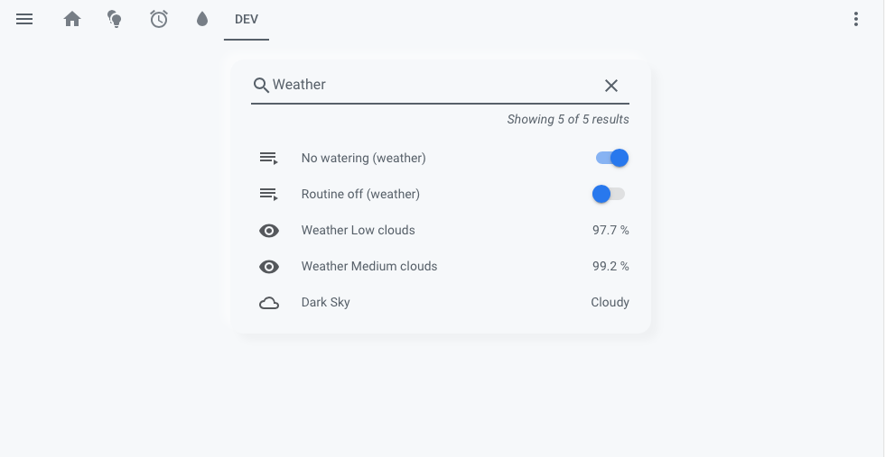

[Search Card](https://github.com/postlund/search-card) and [Card Tools](https://github.com/thomasloven/lovelace-card-tools), by @postlund and @thomasloven

To have a simple Soft UI look on other cards, what you have to do is set the card background as the same as the theme background as well as round the corners then adding a dark and light shadow. It can be done (with [**Card Mod**](https://github.com/thomasloven/lovelace-card-mod)) like this:

<details><summary><b>Click here</b></summary>
<p>
  
``` markdown
# Example entry
style: |
   ha-card {
     background-color: var(--primary-background-color);
     border-radius: 15px;
     box-shadow: 
       
         -8px -8px 8px 0 rgba(255,255,255,.5),8px 8px 8px 0 rgba(0,0,0,.03);
       
         -8px -8px 8px 0 rgba(50, 50, 50,.5),8px 8px 8px 0 rgba(0,0,0,.15);
          
   }       
```
</p>
</details>

# Thank you!
This repository is maintained and developed by
## @N-l1 ✨
