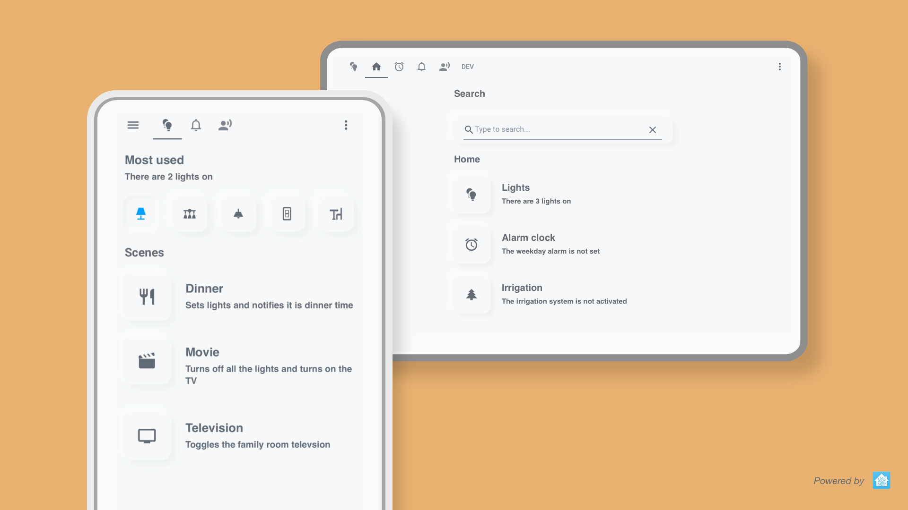
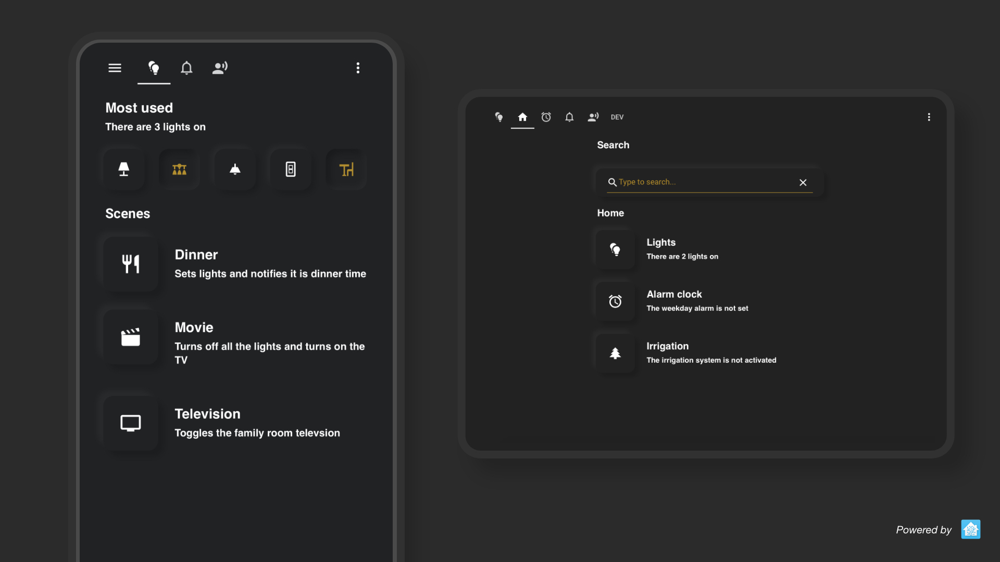
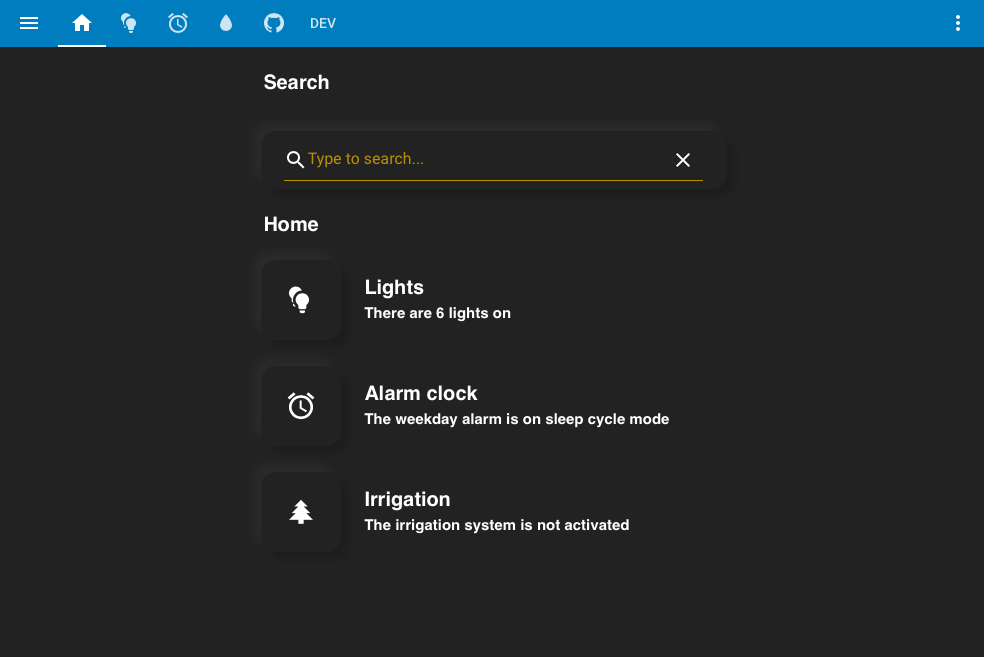
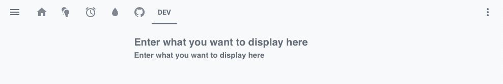
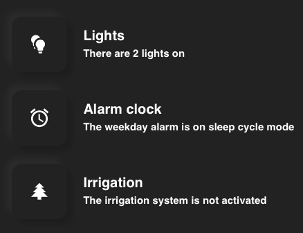
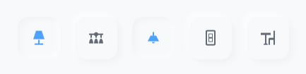
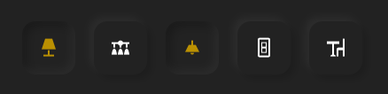
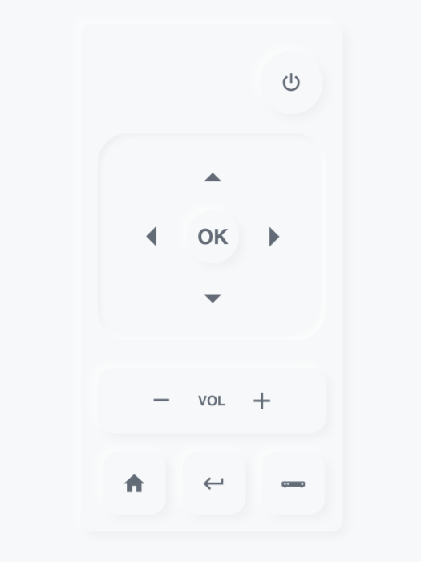
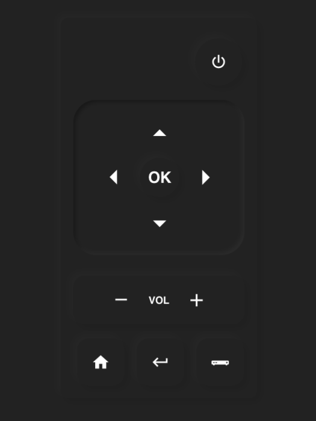

# Lovelace Soft UI 
#### A new user friendly, simple and clean Lovelace configuration

 
 


First and foremost thank you for finding your way to my Home Assistant repo. This is my custom style for Lovelace (UI of Home Assistant). I drew some inspiration from [Soft UI](https://dribbble.com/shots/8027871-Soft-UI/attachments/531358?mode=media) AKA Neumorphism. Hope you like it!

**Home Assistant forum discussions are** [**here**](https://community.home-assistant.io/t/lovelace-soft-ui-simple-and-clean-lovelace-configuration) 

**Example Soft UI dashboards are** [**here**](docs/inspiration.md)  
  



# Let's do it!
### 1. Install card-mod
You will need [**card-mod**](https://github.com/thomasloven/lovelace-card-mod) to be installed, it is easily done via [**HACS**](https://hacs.xyz). 

Please read HACS documentations and install it.

### 2. sun.sun
For the cards to switch automatically to a dark/light theme, please make sure you have the sun.sun entity (should come preinstalled). If you don't have it please add the following to your `configuration.yaml`.

``` markdown
# Example configuration.yaml entry
sun:
```
### 3. Themes
This styling works best with custom themes. They can also be installed with [HACS](https://hacs.xyz). Light themes with a **milky white background** work well, and dark themes with a **dark grey/black background** work well. 

I recommend the [Clear](https://github.com/naofireblade/clear-theme) and [Slate](https://github.com/seangreen2/slate_theme) theme by **@naofireblade** and **@seangreen2**.
### 4. Automation
You will need to setup an automation for automatically switching to a dark theme at sunset and back to a light theme at sunrise. If you don't have one please add the following to your `automations.yaml`.

<details><summary><b>Show code</b></summary>
<p>

``` markdown
# Example automations.yaml entry
- alias: "Light theme after Sunrise"
  trigger:
    platform: sun
    event: sunrise
  action:
    - service: frontend.set_theme
      data:
# Change this to the name of your light theme
        name: Light

- alias: "Dark theme after Sunset"
  trigger:
    platform: sun
    event: sunset
  action:
    - service: frontend.set_theme
      data:
# Change this to the name of your dark theme
        name: Dark

- alias: 'Light theme after reboot in day'
  trigger:
    platform: homeassistant
    event: start
  condition:
    - condition: state
      entity_id: sun.sun
      state: 'above_horizon'
  action:
    service: frontend.set_theme
    data:
# Change this to the name of your light theme
      name: Light

- alias: 'Dark theme after reboot in night'
  trigger:
    platform: homeassistant
    event: start
  condition:
    condition: state
    entity_id: sun.sun
    state: 'below_horizon'
  action:
    service: frontend.set_theme
    data:
# Change this to the name of your dark theme
      name: Dark
```
</p>
</details>

### 5. Done!
We are done! Use this code to add the Soft UI style to any card. 

``` markdown
# Example entry
style: |
  ha-card {
      background-color: var(--primary-background-color);
      border-radius: 15px;
      margin: 10px;
      box-shadow: 
        
          -8px -8px 8px 0 rgba(255,255,255,.5),8px 8px 8px 0 rgba(0,0,0,.03);
        
          -8px -8px 8px 0 rgba(50, 50, 50,.5),8px 8px 8px 0 rgba(0,0,0,.15);
           
   }      
```
For more advanced usage/my personal setup, see below...

# Advanced Usage
Here are some cards I created using this style :) 

All cards are added using the UI: click on the three dots on the top right, then go to `Configure UI` then click on the `+` on the bottom right, then select `MANUAL CARD`. 

Paste in the appropriate code for each card.

## Compact Header
<p align="left">
  
  
  <br/>
  <a href="https://github.com/seangreen2/slate_theme"><b>Slate theme</b></a> header with and without color.
</p>

#### Custom cards needed

* [**Custom Header**](https://maykar.github.io/compact-custom-header/), by **maykar**

This makes the original Home Assistant header "compact" and also matching it with the background color.

Click on the three dots on the top right, then go to `Configure UI` then `Raw config editor` and add the following:

``` markdown
# Example entry
custom_header:
  elements_color: var(--primary-text-color);
  tab_indicator_color: var(--primary-text-color);
  background: var(--primary-background-color);
  compact_mode: true
```

## Text Header Card
</p>
<p align="left">
  
  
  <br/>
  <b>Text header cards</b> with the <b>Light</b> and <b>Dark</b> themes.
</p>

#### Custom cards needed

* [**Card Mod**](https://github.com/thomasloven/lovelace-card-mod), by **@thomasloven**

This card displays texts with transparent background. 

<details><summary><b>Show code</b></summary>
<p>

``` markdown
# Example entry
cards:
  - cards:
# Enter what you want to display
      - content: |
          # Enter what you want to display here
        style: |
          ha-card {
             --paper-card-background-color: 'rgba(11, 11, 11, 0.00)';
             box-shadow: 2px 2px rgba(0,0,0,0.0);
          }
          h1 {
            font-size: 20px;
            font-weight: bold;
            font-family: Helvetica;
            letter-spacing: '-0.01em';
          }
        type: markdown
    type: vertical-stack
type: vertical-stack
```
</p>
</details>

## Text Header Card with Subheader
</p>
<p align="left">
  
  
  <br/>
  <b>Text header cards with subheader</b> with the <b>Light</b> and <b>Dark</b> themes.
</p>

#### Custom cards needed

* [**Card Mod**](https://github.com/thomasloven/lovelace-card-mod), by **@thomasloven**

This card displays texts with smaller texts underneath with transparent background.

<details><summary><b>Show code</b></summary>
<p>

``` markdown
# Example entry
cards:
  - cards:
# Enter what you want to display
      - content: |
          # Enter what you want to display here
        style: |
          ha-card {
            height: 20px;
            --paper-card-background-color: 'rgba(11, 11, 11, 0.00)';
            box-shadow: 2px 2px rgba(0,0,0,0.0);
          }
          h1 {
            font-size: 20px;
            font-weight: bold;
            font-family: Helvetica;
            letter-spacing: '-0.01em';
          }
        type: markdown
# Enter what you want to display in the small text
      - content: |
          # Enter what you want to display here
        style: |
          ha-card {
               height: 50px;
               --paper-card-background-color: 'rgba(11, 11, 11, 0.00)';
               box-shadow: 2px 2px rgba(0,0,0,0.0);
                 }
             h1 {
                  font-size: 15px;
                  font-weight: thin;
                  font-family: Helvetica;
                  letter-spacing: '-0.01em';
                }
        type: markdown
    type: vertical-stack
type: vertical-stack
```
</p>
</details>

## Vertical Buttons Card
</p>
<p align="left">
  
  
  <br/>
  <b>Vertical buttons card</b> with the <b>Light</b> and <b>Dark</b> themes.
</p>

#### Custom cards needed

* [**Button Card**](https://github.com/custom-cards/button-card), by **@RomRider**
* [**Card Mod**](https://github.com/thomasloven/lovelace-card-mod), by **@thomasloven**

#### Template used to count how many lights are on
``` markdown
{{ states | selectattr('entity_id','in', ['light.list_your_lights_here','switch.example_1','switch.example_2'] )|selectattr('state','eq','on') | list | count }}
```
This card contains three buttons lined up vertically: lights, alarm clock, and irrigation. Each of the buttons will redirect you to a Lovelace tab with the corresponding name, i.e lovelace/lights. You can change the icons, names, tap action, and texts beside them. 

<details><summary><b>Show code</b></summary>
<p>

``` markdown
# Example entry
cards:
  - cards:
      - cards:
# Icon to display - First button
          - icon: 'mdi:lightbulb-multiple'
            show_icon: true
            show_name: false
            style: |
              ha-card {
                margin: 10px;
                box-shadow: 
                  
                    -8px -8px 8px 0 rgba(255,255,255,.5),8px 8px 8px 0 rgba(0,0,0,.03);
                  
                    -8px -8px 8px 0 rgba(50, 50, 50,.5),8px 8px 8px 0 rgba(0,0,0,.15);
                                   
              }
            styles:
              card:
                - width: 80px
                - height: 80px
                - border-radius: 15px
                - background-color: var(--primary-background-color)
              icon:
                - color: var(--primary-text-color)
# Action to perform - First button
            tap_action:
              action: navigate
              navigation_path: /lovelace/lights
              haptic: light
            type: 'custom:button-card'
          - cards:
# Big text to display - First button       
              - content: |
                  # Lights
                style: |
                  ha-card {
                    height: 20px;                  
                    --paper-card-background-color: 'rgba(11, 11, 11, 0.00)';
                    box-shadow: 2px 2px rgba(0,0,0,0.0);
                  }
                  h1 {
                    font-size: 20px;
                    font-weight: bold;
                    font-family: Helvetica;
                    letter-spacing: '-0.01em';
                  }
                type: markdown
# Small text to display - First button             
              - content: >              
                  # There are  
                  currently no    {{states('sensor.lights_on')}}   lights on
                style: |
                  ha-card {
                  --paper-card-background-color: 'rgba(11, 11, 11, 0.00)';
                  box-shadow: 2px 2px rgba(0,0,0,0.0);
                     }
                  h1 {
                    font-size: 15px;
                    font-weight: thin;
                    font-family: Helvetica;
                    letter-spacing: '-0.01em';
                  }
                type: markdown
            type: vertical-stack
        type: horizontal-stack
      - cards:
# Icon to display - Second button
          - icon: 'mdi:alarm'
            show_icon: true
            show_name: false
            style: |
              ha-card {
                margin: 10px;
                box-shadow: 
                  
                    -8px -8px 8px 0 rgba(255,255,255,.5),8px 8px 8px 0 rgba(0,0,0,.03);
                  
                    -8px -8px 8px 0 rgba(50, 50, 50,.5),8px 8px 8px 0 rgba(0,0,0,.15);
                      
              }
            styles:
              card:
                - width: 80px
                - height: 80px
                - border-radius: 15px
                - background-color: var(--primary-background-color)
              icon:
                - color: var(--primary-text-color)
# Action to perform - Second button
            tap_action:
              action: navigate         
              navigation_path: /lovelace/alarm
              haptic: light
            type: 'custom:button-card'
          - cards:
# Big text to display - Second button    
              - content: |           
                  # Alarm clock
                style: |
                  ha-card {
                    height: 20px;                  
                    --paper-card-background-color: 'rgba(11, 11, 11, 0.00)';
                    box-shadow: 2px 2px rgba(0,0,0,0.0);
                  }
                  h1 {
                    font-size: 20px;
                    font-weight: bold;
                    font-family: Helvetica;
                    letter-spacing: '-0.01em';
                  }
                type: markdown
# Small text to display - Second button   
              - content: >            
                  # The weekday alarm is    on
                  sleep cycle mode      set
                  for {{states('sensor.alarm_weekday_time')}}    not
                  set  
                style: |
                  ha-card {
                    --paper-card-background-color: 'rgba(11, 11, 11, 0.00)';
                    box-shadow: 2px 2px rgba(0,0,0,0.0);
                  }
                  h1 {
                    font-size: 15px;
                    font-weight: thin;
                    font-family: Helvetica;
                    letter-spacing: '-0.01em';
                  }
                type: markdown
            type: vertical-stack
        type: horizontal-stack
      - cards:
# Icon to display - Third button         
          - icon: 'mdi:pine-tree'
            show_icon: true
            show_name: false
            style: |
              ha-card {
                margin: 10px;
                box-shadow: 
                  
                    -8px -8px 8px 0 rgba(255,255,255,.5),8px 8px 8px 0 rgba(0,0,0,.03);
                  
                    -8px -8px 8px 0 rgba(50, 50, 50,.5),8px 8px 8px 0 rgba(0,0,0,.15);
                     
              }
            styles:
              card:
                - width: 80px
                - height: 80px
                - border-radius: 15px
                - background-color: var(--primary-background-color)
              icon:
                - color: var(--primary-text-color)
# Action to perform - Third button
            tap_action:
              action: navigate
              navigation_path: /lovelace/sprinklers/
              haptic: light
            type: 'custom:button-card'
          - cards:
# Big text to display - Third button
              - content: |             
                  # Irrigation
                style: |
                  ha-card {
                    height: 20px;                  
                    --paper-card-background-color: 'rgba(11, 11, 11, 0.00)';
                    box-shadow: 2px 2px rgba(0,0,0,0.0);
                  }
                  h1 {
                    font-size: 20px;
                    font-weight: bold;
                    font-family: Helvetica;
                    letter-spacing: '-0.01em';
                  }
                type: markdown
# Small text to display - Third button      
              - content: |          
                  # The irrigation system is not activated
                style: |
                  ha-card {
                  --paper-card-background-color: 'rgba(11, 11, 11, 0.00)';
                  box-shadow: 2px 2px rgba(0,0,0,0.0);
                     }
                   h1 {
                   
                   font-size: 15px;
                   font-weight: thin;
                   font-family: Helvetica;
                   letter-spacing: '-0.01em';
                      }
                type: markdown
            type: vertical-stack
        type: horizontal-stack
    type: vertical-stack
type: vertical-stack
```
</p>
</details>

## Horizontal Buttons Card
</p>
<p align="left">
  
  
  <br/>
  <b>Horizontal buttons card</b> with the <b>Light</b> and <b>Dark</b> themes.
</p>

#### Custom cards needed

* [**Button Card**](https://github.com/custom-cards/button-card), by **@RomRider**
* [**Card Mod**](https://github.com/thomasloven/lovelace-card-mod), by **@thomasloven**

This card is five buttons lined up horizontally (like the picture). When the state of the entity is 'on', the button will be depressed. When the entity is 'off' it will be released (like normal). 

This card can resize based on the width of your screen!

<details><summary><b>Show code</b></summary>
<p>

``` markdown
# Example entry
cards:
# Entity to control - First button
  - entity: light.family_room_lamp
# Icon to display - First button
    icon: 'mdi:lamp'
    show_icon: true
    show_name: false
    state:
      - styles:
          icon:
            - color: 'var(--paper-item-icon-active-color)  '
        value: 'on'
# Please change the entities inside to match the entity to be controlled
    style: |
      ha-card {
        margin: 5px;  
        margin-left: 6.5px;
        box-shadow: 
         
           inset -4px -4px 8px 0 rgba(255,255,255,.5), inset 4px 4px 8px 0 rgba(0,0,0,.03);
                               
           -5px -5px 8px 0 rgba(255,255,255,.5),5px 5px 8px 0 rgba(0,0,0,.03);
                               
           inset -4px -4px 10px 0 rgba(50, 50, 50,.5), inset 4px 4px 12px 0 rgba(0,0,0,.3); 
            
           -5px -5px 8px 0 rgba(50, 50, 50,.5),5px 5px 8px 0 rgba(0,0,0,.15);
                               
      }
      @media only screen and (max-width: 600px) {
         ha-card {
           margin: 3px; 
           margin-left: 4px;                   
         }
      }
      @media only screen and (min-width: 1200px) {
         ha-card {
           margin: 8px;  
           margin-left: 11px;               
         }
      }
    styles:
      card:
        - width: 60px
        - height: 60px
        - border-radius: 15px
        - background-color: var(--primary-background-color)
      icon:
        - color: var(--primary-text-color)
    tap_action:
      action: toggle
      haptic: light      
    hold_action: 
      action: more-info
      haptic: medium
    type: 'custom:button-card'
# Entity to control - Second button
  - entity: switch.kitchen_island_light
# Icon to display - Second button
    icon: 'mdi:vanity-light'
    show_icon: true
    show_name: false
    state:
      - styles:
          icon:
            - color: 'var(--paper-item-icon-active-color)  '
        value: 'on'
# Please change the entities inside to match the entity to be controlled
    style: |
      ha-card {
        margin: 5px;  
        margin-left: 6.5px;
        box-shadow: 
          
            inset -4px -4px 8px 0 rgba(255,255,255,.5), inset 4px 4px 8px 0 rgba(0,0,0,.03);
                                
            -5px -5px 8px 0 rgba(255,255,255,.5),5px 5px 8px 0 rgba(0,0,0,.03);
                                
            inset -4px -4px 10px 0 rgba(50, 50, 50,.5), inset 4px 4px 12px 0 rgba(0,0,0,.3); 
             
            -5px -5px 8px 0 rgba(50, 50, 50,.5),5px 5px 8px 0 rgba(0,0,0,.15);
                                
      }
      @media only screen and (max-width: 600px) {
         ha-card {
           margin: 3px; 
           margin-left: 4px;                   
         }
      }
      @media only screen and (min-width: 1200px) {
         ha-card {
           margin: 8px;  
           margin-left: 11px;               
         }
      }
    styles:
      card:
        - width: 60px
        - height: 60px
        - border-radius: 15px
        - background-color: var(--primary-background-color)
      icon:
        - color: var(--primary-text-color)
    tap_action:
      action: toggle
      haptic: light      
    hold_action: 
      action: more-info
      haptic: medium
    type: 'custom:button-card'
# Entity to control - Third button
  - entity: switch.dining_area
# Icon to display - Third button
    icon: 'mdi:ceiling-light'
    show_icon: true
    show_name: false
    state:
      - styles:
          icon:
            - color: 'var(--paper-item-icon-active-color)  '
        value: 'on'
# Please change the entities inside to match the entity to be controlled  
    style: |
      ha-card {
        margin: 5px;                
        box-shadow: 
          
            inset -4px -4px 8px 0 rgba(255,255,255,.5), inset 4px 4px 8px 0 rgba(0,0,0,.03);
                                
            -5px -5px 8px 0 rgba(255,255,255,.5),5px 5px 8px 0 rgba(0,0,0,.03);
                                
            inset -4px -4px 10px 0 rgba(50, 50, 50,.5), inset 4px 4px 12px 0 rgba(0,0,0,.3); 
             
            -5px -5px 8px 0 rgba(50, 50, 50,.5),5px 5px 8px 0 rgba(0,0,0,.15);
                                     
      }
      @media only screen and (max-width: 600px) {
         ha-card {
           margin: 3px; 
           margin-left: 4px;                   
         }
      }
      @media only screen and (min-width: 1200px) {
         ha-card {
           margin: 8px;  
           margin-left: 11px;               
         }
      }
    styles:
      card:
        - width: 60px
        - height: 60px
        - border-radius: 15px
        - background-color: var(--primary-background-color)
      icon:
        - color: var(--primary-text-color)
    tap_action:
      action: toggle
      haptic: light      
    hold_action: 
      action: more-info
      haptic: medium
    type: 'custom:button-card'
# Entity to control - Forth button
  - entity: light.family_room_light
# Icon to display - Forth button
    icon: 'mdi:light-switch'
    show_icon: true
    show_name: false
    state:
      - styles:
          icon:
            - color: 'var(--paper-item-icon-active-color)  '
        value: 'on'
# Please change the entities inside to match the entity to be controlled
    style: |
      ha-card {
        margin: 5px;  
        box-shadow: 
          
            inset -4px -4px 8px 0 rgba(255,255,255,.5), inset 4px 4px 8px 0 rgba(0,0,0,.03);
                                
            -5px -5px 8px 0 rgba(255,255,255,.5),5px 5px 8px 0 rgba(0,0,0,.03);
                                
            inset -4px -4px 10px 0 rgba(50, 50, 50,.5), inset 4px 4px 12px 0 rgba(0,0,0,.3); 
             
            -5px -5px 8px 0 rgba(50, 50, 50,.5),5px 5px 8px 0 rgba(0,0,0,.15);
               
      }
      @media only screen and (max-width: 600px) {
         ha-card {
           margin: 3px; 
           margin-left: 4px;                   
         }
      }
      @media only screen and (min-width: 1200px) {
         ha-card {
           margin: 8px;  
           margin-left: 11px;               
         }
      }
    styles:
      card:
        - width: 60px
        - height: 60px
        - border-radius: 15px
        - background-color: var(--primary-background-color)
      icon:
        - color: var(--primary-text-color)
    tap_action:
      action: toggle
      haptic: light      
    hold_action: 
      action: more-info
      haptic: medium
    type: 'custom:button-card'
# Entity to control - Fifth button
  - entity: switch.dining_table
# Icon to display - Fifth button
    icon: 'mdi:table-chair'
    show_icon: true
    show_name: false
    state:
      - styles:
          icon:
            - color: 'var(--paper-item-icon-active-color)  '
        value: 'on'
# Please change the entities inside to match the entity to be controlled  
    style: |
      ha-card {
        margin: 5px;            
        box-shadow: 
          
            inset -4px -4px 8px 0 rgba(255,255,255,.5), inset 4px 4px 8px 0 rgba(0,0,0,.03);
                                
            -5px -5px 8px 0 rgba(255,255,255,.5),5px 5px 8px 0 rgba(0,0,0,.03);
                                
            inset -4px -4px 10px 0 rgba(50, 50, 50,.5), inset 4px 4px 12px 0 rgba(0,0,0,.3); 
             
            -5px -5px 8px 0 rgba(50, 50, 50,.5),5px 5px 8px 0 rgba(0,0,0,.15);
               
      }
      @media only screen and (max-width: 600px) {
         ha-card {
           margin: 3px; 
           margin-left: 4px;                   
         }
      }
      @media only screen and (min-width: 1200px) {
         ha-card {
           margin: 8px;  
           margin-left: 11px;               
         }
      }
    styles:
      card:
        - width: 60px
        - height: 60px
        - border-radius: 15px
        - background-color: var(--primary-background-color)
      icon:
        - color: var(--primary-text-color)
    tap_action:
      action: toggle
      haptic: light      
    hold_action: 
      action: more-info
      haptic: medium
    type: 'custom:button-card'
type: horizontal-stack            
```
</p>
</details>

## Remote pop-up card
</p>
<p align="left">
  
  
  <br/>
  <b>Remote pop-up card</b> with the <b>Light</b> and <b>Dark</b> themes.
</p>

#### Custom cards needed

* [**Button Card**](https://github.com/custom-cards/button-card), by **@RomRider**
* [**Card Mod**](https://github.com/thomasloven/lovelace-card-mod), by **@thomasloven**

#### Custom components needed

* [**Browser Mod**](https://github.com/thomasloven/hass-browser_mod), by **@thomasloven**

This is a quite special card. Each button on it can be used to control your TV/device. It will pop up when you long press on an entity. For example, you can make it pop-up when you hold on your TV entity. 

To add this card, click on the three dots on the top right, then go to `Configure UI` then click the three dots on the top right again, then select `Raw config editor`  

Add the following to the first line:

<details><summary><b>Show code</b></summary>
<p>

``` markdown
popup_cards:
# Please change this to the entity you want to hold and get the remote
  script.television:
    title: Remote
    card:
      type: vertical-stack
      cards:
       - type: vertical-stack
         cards:
           - type: vertical-stack
             cards:
                - type: vertical-stack
                  cards:
                    - show_icon: false
                      show_name: false
                      style: |
                        ha-card {
                          --paper-card-background-color: 'rgba(11, 11, 11, 0.00)';
                          box-shadow: 2px 2px rgba(0,0,0,0.0);
                        }
                        styles:
                          card:
                            - width: 1px
                            - height: 1px
                      type: 'custom:button-card'
                    - cards:
                        - show_icon: false
                          show_name: false
                          style: |
                            ha-card {
                               --paper-card-background-color: 'rgba(11, 11, 11, 0.00)';
                               box-shadow: 2px 2px rgba(0,0,0,0.0);
                            }
                          styles:
                            card:
                              - width: 50px
                              - height: 60px
                          type: 'custom:button-card'
                        - entities:
                            - cards:
                                - show_icon: false
                                  show_name: false
                                  style: |
                                    ha-card {
                                      --paper-card-background-color: 'rgba(11, 11, 11, 0.00)';
                                      box-shadow: 2px 2px rgba(0,0,0,0.0);
                                    }
                                  styles:
                                    card:
                                      - width: 150px
                                      - height: 60px
                                  type: 'custom:button-card'
                                - icon: 'mdi:power'
                                  show_icon: true
                                  show_name: false
                                  style: |
                                    ha-card {
                                      box-shadow: 
                                        
                                          -5px -5px 5px 0 rgba(255,255,255,.5),5px 5px 5px 0 rgba(0,0,0,.03);
                                        
                                          -5px -5px 5px 0 rgba(50, 50, 50,.5),5px 5px 5px 0 rgba(0,0,0,.15);
                                                        
                                    }                
                                  styles:
                                    card:
                                      - width: 60px
                                      - height: 60px
                                      - border-radius: 100px
                                      - background-color: var(--primary-background-color)
                                    icon:
                                      - color: var(--primary-text-color)
                                  tap_action:
                                    action: call-service
# Please change this to a service you call to toggle the TV/device
                                    service: remote.send_command
                                    service_data:
                                      command: power
                                      entity_id: remote.xiaomi
                                  type: 'custom:button-card'
                                - show_icon: false
                                  show_name: false
                                  style: |
                                    ha-card {
                                      --paper-card-background-color: 'rgba(11, 11, 11, 0.00)';
                                      box-shadow: 2px 2px rgba(0,0,0,0.0);
                                    }
                                  styles:
                                    card:
                                      - width: 10px
                                      - height: 60px
                                  type: 'custom:button-card'
                              type: 'custom:hui-horizontal-stack-card'
                            - show_icon: false
                              show_name: false
                              style: |
                                ha-card {
                                  --paper-card-background-color: 'rgba(11, 11, 11, 0.00)';
                                  box-shadow: 2px 2px rgba(0,0,0,0.0);
                                }
                              styles:
                                card:
                                  - width: 10px
                                  - height: 10px
                              type: 'custom:button-card'
                            - cards:
                                - entities:
                                    - cards:
                                        - show_icon: false
                                          show_name: false
                                          style: |
                                            ha-card {
                                              --paper-card-background-color: 'rgba(11, 11, 11, 0.00)';
                                              box-shadow: 2px 2px rgba(0,0,0,0.0);
                                            }
                                          styles:
                                            card:
                                              - width: 63px
                                              - height: 10px
                                          type: 'custom:button-card'
                                        - icon: 'mdi:menu-up'
                                          show_icon: true
                                          show_name: false
                                          size: 100%
                                          styles:
                                            card:
                                              - box-shadow: none
                                              - width: 50px
                                              - height: 50px
                                              - background-color: var(--primary-background-color)
                                            icon:
                                              - color: var(--primary-text-color)
                                          tap_action:
                                            action: call-service
# Please change this to a service you call to go 'up' on the TV/device                                            
                                            service: remote.send_command
                                            service_data:
                                              command: up
                                              entity_id: remote.xiaomi
                                          type: 'custom:button-card'
                                      type: 'custom:hui-horizontal-stack-card'
                                    - cards:
                                        - show_icon: false
                                          show_name: false
                                          style: |
                                            ha-card {
                                              --paper-card-background-color: 'rgba(11, 11, 11, 0.00)';
                                              box-shadow: 2px 2px rgba(0,0,0,0.0);
                                            }
                                          styles:
                                            card:
                                              - width: 5px
                                              - height: 10px
                                          type: 'custom:button-card'
                                        - icon: 'mdi:menu-left'
                                          show_icon: true
                                          show_name: false
                                          size: 100%
                                          styles:
                                            card:
                                              - box-shadow: none
                                              - width: 50px
                                              - height: 50px
                                              - background-color: var(--primary-background-color)
                                            icon:
                                              - color: var(--primary-text-color)
                                          tap_action:
                                            action: call-service
# Please change this to a service you call to go 'left' on the TV/device                                              
                                            service: remote.send_command
                                            service_data:
                                              command: left
                                              entity_id: remote.xiaomi
                                          type: 'custom:button-card'
                                        - name: OK
                                          show_icon: false
                                          show_name: true
                                          style: |
                                            ha-card {
                                              box-shadow: 
                                                
                                                  -4px -4px 4px 0 rgba(255,255,255,.5),4px 4px 4px 0 rgba(0,0,0,.03);
                                                
                                                  -4px -4px 4px 0 rgba(50, 50, 50,.5),4px 4px 4px 0 rgba(0,0,0,.15);
                                                                
                                            }
                                          styles:
                                            card:
                                              - width: 50px
                                              - height: 50px
                                              - border-radius: 100px
                                              - background-color: var(--primary-background-color)
                                            name:
                                              - font-size: 20px
                                              - font-weight: bold
                                              - font-family: Helvetica
                                              - letter-spacing: '-0.01em'
                                          tap_action:
# Please change this to a service you call to 'enter' on the TV/device                                            
                                            action: call-service
                                            service: remote.send_command
                                            service_data:
                                              command: enter
                                              entity_id: remote.xiaomi
                                          type: 'custom:button-card'
                                        - icon: 'mdi:menu-right'
                                          show_icon: true
                                          show_name: false
                                          size: 100%
                                          styles:
                                            card:
                                              - box-shadow: none
                                              - width: 50px
                                              - height: 50px
                                              - background-color: var(--primary-background-color)
                                            icon:
                                              - color: var(--primary-text-color)
                                          tap_action:
                                            action: call-service
# Please change this to a service you call to go 'right' on the TV/device                                             
                                            service: remote.send_command
                                            service_data:
                                              command: right
                                              entity_id: remote.xiaomi
                                          type: 'custom:button-card'
                                      type: 'custom:hui-horizontal-stack-card'
                                    - cards:
                                        - show_icon: false
                                          show_name: false
                                          style: |
                                            ha-card {
                                              --paper-card-background-color: 'rgba(11, 11, 11, 0.00)';
                                              box-shadow: 2px 2px rgba(0,0,0,0.0);
                                            }
                                          styles:
                                            card:
                                              - width: 63px
                                              - height: 10px
                                          type: 'custom:button-card'
                                        - icon: 'mdi:menu-down'
                                          show_icon: true
                                          show_name: false
                                          size: 100%
                                          styles:
                                            card:
                                              - box-shadow: none
                                              - width: 50px
                                              - height: 50px
                                              - background-color: var(--primary-background-color)
                                            icon:
                                              - color: var(--primary-text-color)
                                          tap_action:
                                            action: call-service
# Please change this to a service you call to go 'down' on the TV/device                                             
                                            service: remote.send_command
                                            service_data:
                                              command: down
                                              entity_id: remote.xiaomi
                                          type: 'custom:button-card'
                                      type: 'custom:hui-horizontal-stack-card'
                                  show_header_toggle: false
                                  style: |
                                    ha-card {                           
                                      box-shadow: 
                                        
                                          inset -4px -4px 5px 0 rgba(255,255,255,.7), inset 4px 4px 5px 0 rgba(0,0,0,.07);
                                        
                                          inset -4px -4px 10px 0 rgba(50, 50, 50,.5), inset 4px 4px 12px 0 rgba(0,0,0,.3); 
                                                            
                                      border-radius: 30px;
                                      background-color: var(--primary-background-color)
                                    }
                                  type: 'custom:hui-entities-card'
                              type: 'custom:hui-horizontal-stack-card'
                            - show_icon: false
                              show_name: false
                              style: |
                                ha-card {
                                  --paper-card-background-color: 'rgba(11, 11, 11, 0.00)';
                                  box-shadow: 2px 2px rgba(0,0,0,0.0);
                                }
                              styles:
                                card:
                                  - width: 10px
                                  - height: 10px
                              type: 'custom:button-card'
                            - cards:
                                - entities:
                                    - cards:
                                        - show_icon: false
                                          show_name: false
                                          style: |
                                            ha-card {
                                              --paper-card-background-color: 'rgba(11, 11, 11, 0.00)';
                                              box-shadow: 2px 2px rgba(0,0,0,0.0);
                                            }
                                          styles:
                                            card:
                                              - width: 17px
                                              - height: 10px
                                          type: 'custom:button-card'
                                        - icon: 'mdi:minus'
                                          show_icon: true
                                          show_name: false
                                          size: 100%
                                          styles:
                                            card:
                                              - box-shadow: none
                                              - width: 30px
                                              - height: 30px
                                              - background-color: var(--primary-background-color)
                                            icon:
                                              - color: var(--primary-text-color)
                                          tap_action:
                                            action: call-service
# Please change this to a service you call to 'volume down' on the TV/device                                              
                                            service: remote.send_command
                                            service_data:
                                              command: volume_down_sony
                                              entity_id: remote.xiaomi
                                          type: 'custom:button-card'
                                        - show_icon: false
                                          show_name: false
                                          style: |
                                            ha-card {
                                              --paper-card-background-color: 'rgba(11, 11, 11, 0.00)';
                                              box-shadow: 2px 2px rgba(0,0,0,0.0);
                                            }
                                          styles:
                                            card:
                                              - width: 10px
                                              - height: 10px
                                          type: 'custom:button-card'
                                        - name: VOL
                                          show_icon: false
                                          show_name: true
                                          styles:
                                            card:
                                              - box-shadow: none
                                              - width: 30px
                                              - height: 30px
                                              - border-radius: 100px
                                              - background-color: var(--primary-background-color)
                                            name:
                                              - font-size: 13px
                                              - font-weight: bold
                                              - font-family: Helvetica
                                              - letter-spacing: '-0.01em'
                                          type: 'custom:button-card'
                                        - show_icon: false
                                          show_name: false
                                          style: |
                                            ha-card {
                                              --paper-card-background-color: 'rgba(11, 11, 11, 0.00)';
                                              box-shadow: 2px 2px rgba(0,0,0,0.0);
                                            }
                                          styles:
                                            card:
                                              - width: 10px
                                              - height: 10px
                                          type: 'custom:button-card'
                                        - icon: 'mdi:plus'
                                          show_icon: true
                                          show_name: false
                                          size: 100%
                                          styles:
                                            card:
                                              - box-shadow: none
                                              - width: 30px
                                              - height: 30px
                                              - background-color: var(--primary-background-color)
                                            icon:
                                              - color: var(--primary-text-color)
                                          tap_action:
                                            action: call-service
# Please change this to a service you call to 'volume up' on the TV/device                                             
                                            service: remote.send_command
                                            service_data:
                                              command: volume_up_sony
                                              entity_id: remote.xiaomi
                                          type: 'custom:button-card'
                                      type: 'custom:hui-horizontal-stack-card'
                                  show_header_toggle: false
                                  style: |
                                    ha-card {
                                      box-shadow: 
                                        
                                           -5px -5px 5px 0 rgba(255,255,255,.5),5px 5px 5px 0 rgba(0,0,0,.03);
                                        
                                          -5px -5px 5px 0 rgba(50, 50, 50,.5),5px 5px 5px 0 rgba(0,0,0,.15);
                                                        
                                      border-radius: 30px;
                                      background-color: var(--primary-background-color)
                                    }
                                  type: 'custom:hui-entities-card'
                              type: 'custom:hui-horizontal-stack-card'
                            - show_icon: false
                              show_name: false
                              style: |
                                ha-card {
                                  --paper-card-background-color: 'rgba(11, 11, 11, 0.00)';
                                  box-shadow: 2px 2px rgba(0,0,0,0.0);
                                }
                              styles:
                                card:
                                  - width: 10px
                                  - height: 10px
                              type: 'custom:button-card'
                            - cards:
# The first button in the bottom, you can change the icon here. In my case it is 'home'                            
                                - icon: 'mdi:home'
                                  show_icon: true
                                  show_name: false
                                  style: |
                                    ha-card {
                                      box-shadow: 
                                        
                                          -5px -5px 5px 0 rgba(255,255,255,.5),5px 5px 5px 0 rgba(0,0,0,.03);
                                        
                                          -5px -5px 5px 0 rgba(50, 50, 50,.5),5px 5px 5px 0 rgba(0,0,0,.15);
                                                        
                                    }
                                  styles:
                                    card:
                                      - width: 60px
                                      - height: 60px
                                      - border-radius: 15px
                                      - background-color: var(--primary-background-color)
                                    icon:
                                      - color: var(--primary-text-color)
                                  tap_action:
                                    action: call-service
# Please change this to a service you want to call on the first button                              
                                    service: remote.send_command
                                    service_data:
                                      command: home
                                      entity_id: remote.xiaomi
                                  type: 'custom:button-card'
                                - show_icon: false
                                  show_name: false
                                  style: |
                                    ha-card {
                                      --paper-card-background-color: 'rgba(11, 11, 11, 0.00)';
                                      box-shadow: 2px 2px rgba(0,0,0,0.0);
                                    }
                                  styles:
                                    card:
                                      - width: 5px
                                      - height: 60px
                                  type: 'custom:button-card'
# The second button in the bottom, you can change the icon here. In my case it is 'return'                                    
                                - icon: 'mdi:keyboard-return'
                                  show_icon: true
                                  show_name: false
                                  style: |
                                    ha-card {
                                      box-shadow: 
                                        
                                          -5px -5px 5px 0 rgba(255,255,255,.5),5px 5px 5px 0 rgba(0,0,0,.03);
                                        
                                          -5px -5px 5px 0 rgba(50, 50, 50,.5),5px 5px 5px 0 rgba(0,0,0,.15);
                                                       
                                    }
                                  styles:
                                    card:
                                      - width: 60px
                                      - height: 60px
                                      - border-radius: 15px
                                      - background-color: var(--primary-background-color)
                                    icon:
                                      - color: var(--primary-text-color)
                                  tap_action:
                                    action: call-service
# Please change this to a service you want to call on the second button                                     
                                    service: remote.send_command
                                    service_data:
                                      command: return
                                      entity_id: remote.xiaomi
                                  type: 'custom:button-card'
                                - show_icon: false
                                  show_name: false
                                  style: |
                                    ha-card {
                                      --paper-card-background-color: 'rgba(11, 11, 11, 0.00)';
                                      box-shadow: 2px 2px rgba(0,0,0,0.0);
                                    }
                                  styles:
                                    card:
                                      - width: 5px
                                      - height: 60px
                                  type: 'custom:button-card'
# The third button in the bottom, you can change the icon here. In my case it is a set top box.                                    
                                - icon: 'mdi:set-top-box'
                                  show_icon: true
                                  show_name: false
                                  style: |
                                    ha-card {
                                      box-shadow: 
                                        
                                          -5px -5px 5px 0 rgba(255,255,255,.5),5px 5px 5px 0 rgba(0,0,0,.03);
                                        
                                          -5px -5px 5px 0 rgba(50, 50, 50,.5),5px 5px 5px 0 rgba(0,0,0,.15);
                                                        
                                    }
                                  styles:
                                    card:
                                      - width: 60px
                                      - height: 60px
                                      - border-radius: 15px
                                      - background-color: var(--primary-background-color)
                                    icon:
                                      - color: var(--primary-text-color)
                                  tap_action:
                                    action: call-service
# Please change this to a service you want to call on the third button                                      
                                    service: script.turn_on
                                    service_data:
                                      entity_id: script.mi_box
                                  type: 'custom:button-card'
                              type: 'custom:hui-horizontal-stack-card'
                          show_header_toggle: false
                          style: |
                            ha-card {
                              background-color: var(--primary-background-color);
                              width: 250px;
                              box-shadow:
                                
                                   -6px -6px 6px 0 rgba(255,255,255,.5),6px 6px 6px 0 rgba(0,0,0,.03);
                                
                                  -6px -6px 6px 0 rgba(77, 77, 77,.5),6px 6px 6px 0 rgba(0,0,0,.3);
                                 
                              border-radius: 10px;
                            }
                          type: entities
                      type: horizontal-stack
                    - show_icon: false
                      show_name: false
                      style: |
                        ha-card {
                          --paper-card-background-color: 'rgba(11, 11, 11, 0.00)';
                          box-shadow: 2px 2px rgba(0,0,0,0.0);
                        }
                        styles:
                          card:
                            - width: 5px
                            - height: 5px
                      type: 'custom:button-card'
```
</p>
</details>

Then for it to pop-up when you are holding a button.

Add the following to the button-card config of the entity you want to hold to get the remote:

``` markdown
hold_action:
  action: more-info
```
# Thank you!
This repository is maintained and developed by
## @N-l1 ✨
