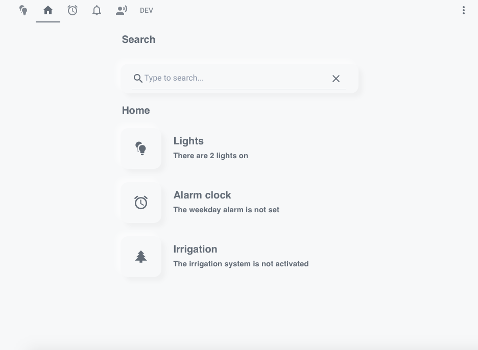
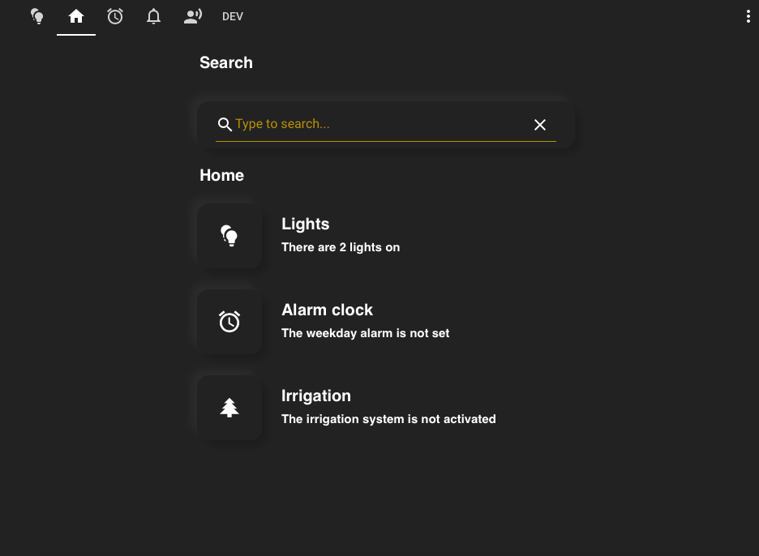
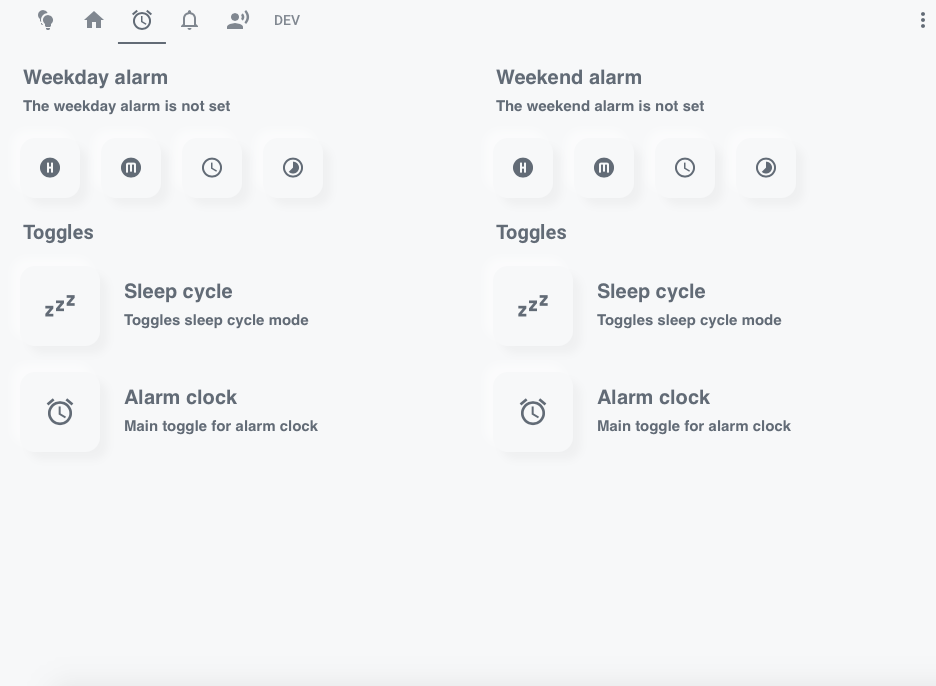
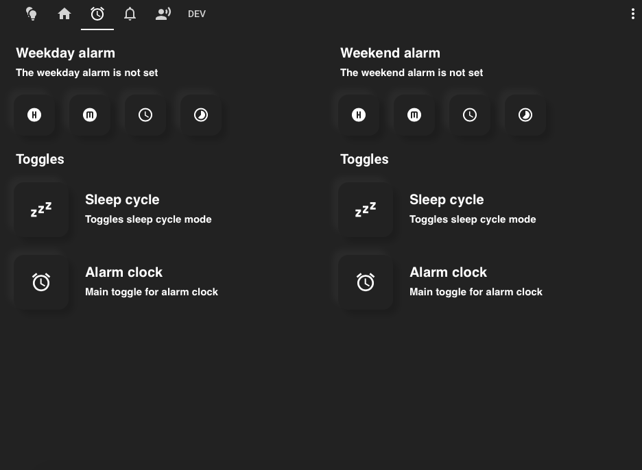
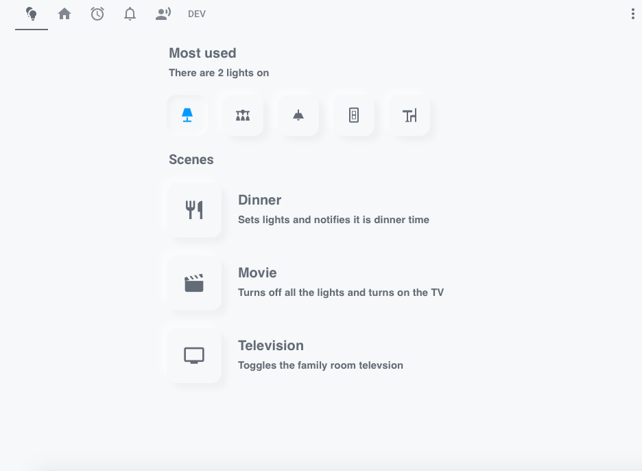
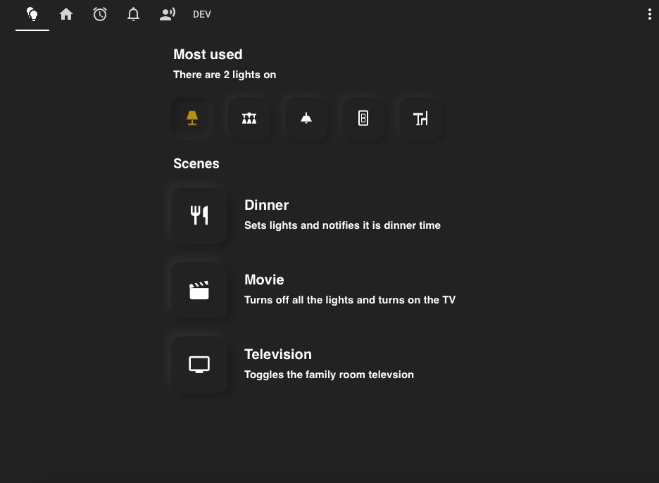

# Inspiration
Here you can find some inspiration for your Soft UI dashboards.  

The lovelace code for the UI elements can be found in the [readme](https://github.com/N-l1/lovelace-soft-ui/blob/master/README.md).  

##

  
  

  
  

  
  

